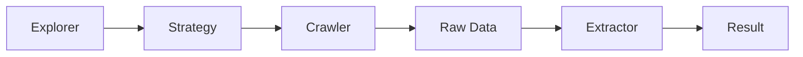
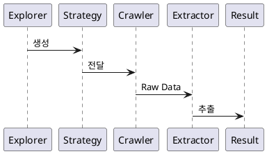

# CLAUDE.md

This file provides guidance to Claude Code (claude.ai/code) when working with code in this repository.

- 모든 대화를 할때는 `GLOBAL-`접두어가 붙은 문서의 컨텍스트는 항상 읽어두어야함

## 언어 규칙

- **대화**: 항상 한글로 응답
- **문서**: 모든 문서(md 파일 등)는 한글로 작성
- **코드**: 영어로 작성 (변수명, 함수명, 주석, docstring, 파일명 등)
- **커밋 메시지**: 한글로 작성

## 폴더 구조

- `design/` - 내부 설계 문서 (리서치, 아키텍처, DSL 설계 등)
- `docs/` - 사용자 문서 (가이드, API 레퍼런스, 튜토리얼)
- `scripts/` - 일회성 스크립트
- `playground/` - 웹 기반 다이어그램 에디터

## 문서 작성 규칙

- 설계 문서(`design/`): 파일명은 3자리 순서 번호로 시작 (예: `001-research.md`)
- 사용자 문서(`docs/`): 명확한 주제별 이름 사용 (예: `getting-started.md`, `api-reference.md`)
- 반드시 LLM이 전역적으로 확인해야하는 문서는 `GLOBAL-`이라는 접두어를 붙임.

## 다이어그램 규칙

설계 문서에는 **흐름도/아키텍처 다이어그램**을 반드시 포함:

- **Mermaid** 또는 **PlantUML** 사용 (마크다운 코드블록으로 삽입)
- 복잡한 흐름은 다이어그램으로 먼저 표현 후 설명
- 다이어그램 종류:
  - `flowchart` / `graph`: 흐름도, 프로세스
  - `sequenceDiagram`: 모듈 간 상호작용
  - `classDiagram`: 클래스/모듈 구조
  - `erDiagram`: DB 스키마
  - `stateDiagram`: 상태 머신

**예시 (Mermaid)**:


**예시 (PlantUML)**:


## 커밋 메시지 규칙

커밋 메시지는 다음 형식을 따름 (git hook으로 자동 검증):

```
[TYPE] 제목

- 불릿 포인트 (선택, 최대 3줄)
```

**허용되는 TYPE**:
| TYPE | 설명 |
|------|------|
| `FEAT` | 새로운 기능 |
| `FIX` | 버그 수정 |
| `DOCS` | 문서 변경 |
| `STYLE` | 코드 포맷팅 |
| `REFACTOR` | 리팩토링 |
| `TEST` | 테스트 |
| `CHORE` | 기타 작업 |
| `PERF` | 성능 개선 |
| `CI` | CI/CD |
| `BUILD` | 빌드 설정 |

**예시**:
```
[FEAT] 사용자 인증 기능 추가

- JWT 토큰 기반 인증 구현
- 로그인/로그아웃 API 추가
```

**주의**: Claude 서명은 git hook에서 자동 제거됨

## 개발 프로세스

기능 개발 시 다음 순서를 따름:

1. **UI 설계** - 화면 구성, 컴포넌트 구조, 사용자 흐름 설계
2. **UI 구현** - 프론트엔드 코드 작성 (목업/스텁 데이터 사용 가능)
3. **서버 기능 개발** - UI에서 필요로 하는 API/백엔드 로직 구현

이 순서를 통해 사용자 경험을 먼저 검증하고, 실제 필요한 서버 기능만 개발할 수 있음.

## 의사결정 규칙

- **시스템적 의사결정**(아키텍처, 모듈 구조, 기술 선택 등)은 반드시 사용자와 질의응답을 통해 결정
- **한 번의 대화에 하나의 질문만** 던져서 명확한 답변을 받은 후 다음 질문으로 진행
- 의사결정 결과는 `design/` 폴더에 문서로 기록

