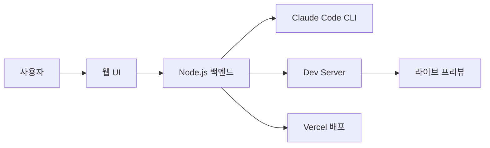
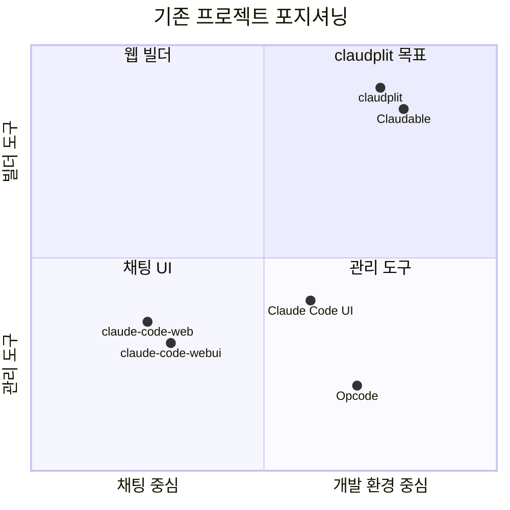

# 유사 오픈소스 프로젝트 리서치

> 작성일: 2025-12-29
> 목적: claudplit과 유사한 기능을 제공하는 기존 오픈소스 프로젝트 조사

## 프로젝트 목표 요약

| 항목 | 내용 |
|------|------|
| **목표** | Replit 대체재 (로컬 실행, Claude Code 구독만 활용) |
| **핵심 기능** | 코드 생성/편집, 실시간 프리뷰, AI 채팅 |
| **대상** | 프론트엔드 앱, 풀스택 앱 |
| **아키텍처** | 웹 UI + Claude Code CLI (`-p` 모드) 래핑 |

---

## 유사 프로젝트 분석

### 1. Claudable (가장 유사)

> **GitHub**: https://github.com/opactorai/Claudable



| 항목 | 내용 |
|------|------|
| **설명** | 로컬 CLI 에이전트를 활용한 웹 빌더 |
| **프론트엔드** | Next.js, React, Tailwind CSS, shadcn/ui |
| **백엔드** | Node.js |
| **DB** | SQLite (로컬), Supabase (프로덕션) |
| **배포** | Vercel 통합 |
| **라이선스** | MIT |

**주요 기능:**
- 자연어 → 코드 생성
- 즉시 프리뷰 (핫 리로드)
- 원클릭 배포 (Vercel)
- 데이터베이스 연동 (Supabase)
- 데스크톱 앱 (Electron)
- GitHub 연동

**지원 AI 에이전트:**
- Claude Code (권장)
- Codex CLI
- Cursor CLI
- Qwen Code
- Gemini CLI

**claudplit과의 비교:**
| 기능 | Claudable | claudplit 목표 |
|------|-----------|---------------|
| 라이브 프리뷰 | ✅ | ✅ |
| Claude Code 연동 | ✅ | ✅ |
| 로컬 실행 | ✅ | ✅ |
| 배포 기능 | ✅ (Vercel) | ❌ (필요없음) |
| 다중 에이전트 | ✅ | ❌ (Claude Code만) |

---

### 2. Claude Code UI

> **GitHub**: https://github.com/siteboon/claudecodeui

| 항목 | 내용 |
|------|------|
| **설명** | Claude Code 세션/프로젝트 관리 웹 UI |
| **백엔드** | Node.js + Express, WebSocket |
| **프론트엔드** | React 18 + Vite, CodeMirror, Tailwind CSS |
| **라이선스** | GPL-3.0 |

**주요 기능:**
- 프로젝트/세션 자동 검색 및 그룹화
- 반응형 채팅 인터페이스
- 통합 셸 터미널
- 파일 탐색기 (구문 강조, 라이브 편집)
- Git 탐색기 (스테이징, 커밋, 브랜치)
- TaskMaster AI (칸반 보드)

**설치:**
```bash
npx @siteboon/claude-code-ui
```

**claudplit과의 비교:**
| 기능 | Claude Code UI | claudplit 목표 |
|------|---------------|---------------|
| 라이브 프리뷰 | ❌ | ✅ |
| 파일 편집 | ✅ | ✅ |
| 세션 관리 | ✅ | △ |
| 프로젝트 관리 | ✅ | ✅ |

---

### 3. claude-code-webui

> **GitHub**: https://github.com/sugyan/claude-code-webui

| 항목 | 내용 |
|------|------|
| **설명** | Claude CLI 웹 인터페이스 (스트리밍 채팅) |
| **백엔드** | Deno 또는 Node.js |
| **프론트엔드** | Vite |
| **특징** | Claude Code로 개발됨 |

**주요 기능:**
- 실시간 스트리밍 응답
- 프로젝트 선택기
- 권한 제어
- 계획 모드 전환
- 다크/라이트 테마

**claudplit과의 비교:**
| 기능 | claude-code-webui | claudplit 목표 |
|------|------------------|---------------|
| 라이브 프리뷰 | ❌ | ✅ |
| 채팅 인터페이스 | ✅ | ✅ |
| 프로젝트 관리 | ✅ | ✅ |

---

### 4. claude-code-web

> **GitHub**: https://github.com/sunpix/claude-code-web

| 항목 | 내용 |
|------|------|
| **설명** | Nuxt 4 기반 Claude Code 웹 인터페이스 |
| **프레임워크** | Nuxt 4 |
| **특징** | PWA, 모바일 우선 |
| **라이선스** | MIT |

**주요 기능:**
- 음성 입력 (Whisper)
- 음성 출력 (TTS)
- 드래그앤드롭 이미지
- 할일 사이드바
- 단축키

**설치:**
```bash
npm install -g @sunpix/claude-code-web
claude-code-web
```

**claudplit과의 비교:**
| 기능 | claude-code-web | claudplit 목표 |
|------|----------------|---------------|
| 라이브 프리뷰 | ❌ | ✅ |
| 음성 입력 | ✅ | ❌ |
| PWA | ✅ | △ |

---

### 5. Opcode (구 Claudia)

> **GitHub**: https://github.com/winfunc/opcode

| 항목 | 내용 |
|------|------|
| **설명** | Claude Code GUI 데스크톱 앱 |
| **프론트엔드** | React 18 + TypeScript + Vite 6 |
| **백엔드** | Rust + Tauri 2 |
| **UI** | Tailwind CSS v4 + shadcn/ui |
| **DB** | SQLite |
| **라이선스** | AGPL-3.0 |

**주요 기능:**
- 프로젝트/세션 관리
- 커스텀 에이전트 생성
- 사용량 분석 대시보드
- MCP 서버 관리
- 타임라인/체크포인트
- CLAUDE.md 편집기

**claudplit과의 비교:**
| 기능 | Opcode | claudplit 목표 |
|------|--------|---------------|
| 라이브 프리뷰 | ❌ | ✅ |
| 세션 관리 | ✅ | △ |
| 사용량 분석 | ✅ | ❌ |
| 웹 기반 | ❌ (데스크톱) | ✅ |

---

## 비교 요약



| 프로젝트 | 라이브 프리뷰 | 웹 기반 | 로컬 실행 | Claude Code 전용 | 라이선스 |
|----------|-------------|--------|----------|-----------------|----------|
| **Claudable** | ✅ | ✅ | ✅ | ❌ (다중 에이전트) | MIT |
| Claude Code UI | ❌ | ✅ | ✅ | ❌ (Cursor 등) | GPL-3.0 |
| claude-code-webui | ❌ | ✅ | ✅ | ✅ | - |
| claude-code-web | ❌ | ✅ | ✅ | ✅ | MIT |
| Opcode | ❌ | ❌ | ✅ | ✅ | AGPL-3.0 |

---

## 핵심 발견

### Claudable이 가장 유사함

Claudable은 claudplit이 목표로 하는 기능의 대부분을 이미 구현:
- 자연어 → 코드 생성
- 라이브 프리뷰 (핫 리로드)
- 로컬 실행
- Claude Code 지원

### Claudable 기술 분석

| 항목 | 상태 | 비고 |
|------|------|------|
| **Claude CLI 직접 호출** | ✅ 예 | subprocess 방식 |
| **모바일 반응형 UI** | ❌ 없음 | 데스크톱 중심 설계 |
| **PWA 지원** | ❌ 없음 | Electron 앱 중심 |

**아키텍처:**
```
[Next.js Frontend] → [Python Backend (apps/api)] → [subprocess] → [claude CLI]
```

**증거:**
- GitHub 이슈: "Claude Code CLI not installed or not working" 에러 존재
- 릴리스: "Fully CLI-Powered Multi-Agent Web Builder"

### 차별화 가능 영역

만약 claudplit을 별도로 개발한다면, 다음 영역에서 차별화 가능:

| 영역 | Claudable | claudplit 차별화 포인트 |
|------|-----------|----------------------|
| **에이전트** | 다중 에이전트 지원 | Claude Code 전용 (심플) |
| **배포** | Vercel 통합 | 배포 없음 (순수 개발용) |
| **DB** | Supabase 통합 | 필요시 추가 |
| **복잡도** | 기능 다양 | 최소 기능, 빠른 시작 |
| **목적** | 프로덕션 앱 빌드 | 프로토타이핑/학습 |

---

## 결론 및 제안

### 옵션 1: Claudable 사용

Claudable이 이미 목표 기능을 제공하므로, 직접 사용하는 것을 고려

**장점:**
- 즉시 사용 가능
- 활발한 개발 중
- MIT 라이선스

**단점:**
- 다중 에이전트 지원으로 복잡도 높음
- 배포 기능 등 불필요한 기능 포함

### 옵션 2: claudplit 신규 개발

더 심플하고 Claude Code에 특화된 도구 개발

**장점:**
- 필요한 기능만 포함
- Claude Code 최적화
- 학습/커스터마이징 용이

**단점:**
- 개발 시간 필요
- 기존 프로젝트와 중복

### 옵션 3: 기존 프로젝트 포크/기여

Claudable 또는 다른 프로젝트를 포크하여 커스터마이징

**장점:**
- 기존 코드베이스 활용
- 빠른 시작

**단점:**
- 업스트림 변경 추적 필요
- 라이선스 제약

---

## 참고 링크

- [Claudable GitHub](https://github.com/opactorai/Claudable)
- [Claude Code UI GitHub](https://github.com/siteboon/claudecodeui)
- [claude-code-webui GitHub](https://github.com/sugyan/claude-code-webui)
- [claude-code-web GitHub](https://github.com/sunpix/claude-code-web)
- [Opcode GitHub](https://github.com/winfunc/opcode)
- [Replit Alternatives (Qodo)](https://www.qodo.ai/blog/replit-alternatives/)
- [Open Source Replit Alternatives](https://openalternative.co/alternatives/replit)
