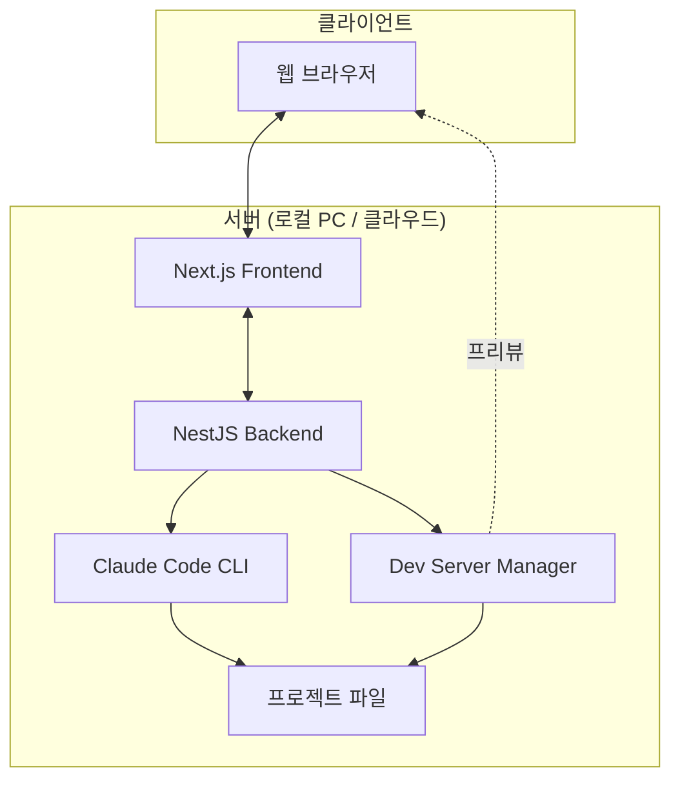
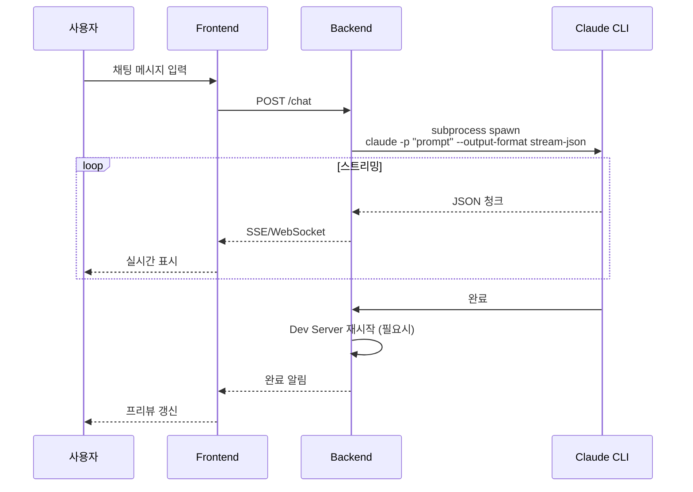
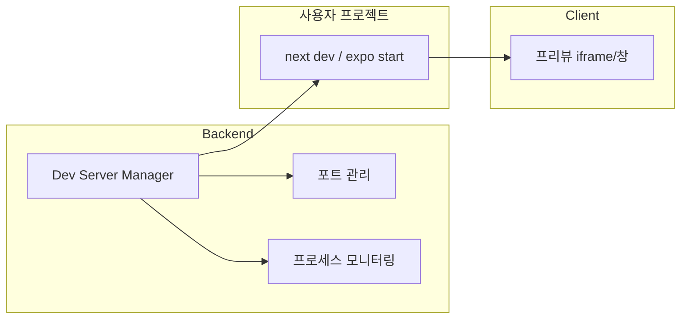
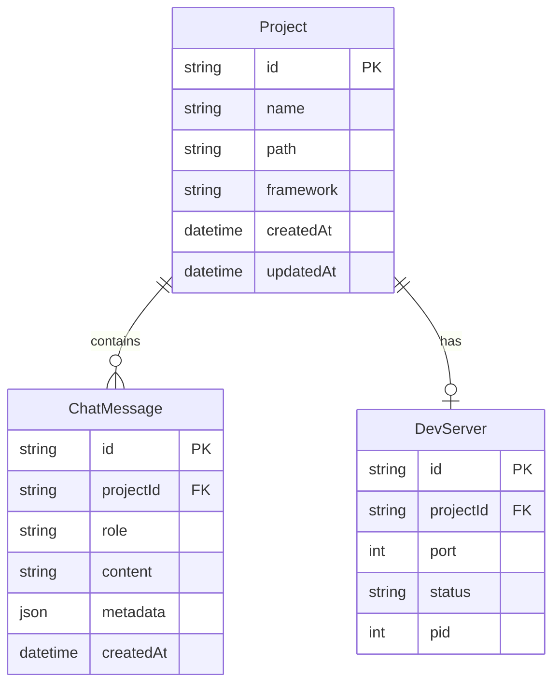

# claudplit 요구사항 정의서

> 작성일: 2025-12-29
> 버전: 1.0

---

## 1. 프로젝트 개요

### 1.1 프로젝트 목표

| 항목 | 내용 |
|------|------|
| **프로젝트명** | claudplit (Claude + Replit) |
| **핵심 목표** | Replit 대체재 - 로컬/클라우드 서버에서 실행 |
| **비용 구조** | Claude Code 구독만으로 사용 (추가 API 비용 없음) |
| **핵심 가치** | 빠른 피드백 루프 (코드 작성 → 프리뷰 확인) |

### 1.2 프로젝트 유형

**AI 빌더** (웹 IDE 아님)
- 채팅으로 요청 → Claude Code가 코드 생성
- 프리뷰로 결과 확인
- 코드 편집은 VS Code 등 기존 도구 활용

### 1.3 Claudable과의 차별점

| 영역 | Claudable | claudplit |
|------|-----------|-----------|
| **AI 연동** | Claude Agent SDK | Claude Code CLI |
| **인증** | API 키 필요 가능 | 구독만으로 OK |
| **프레임워크** | Next.js 전용 | Next.js + React Native |
| **UI** | 데스크톱 중심 | 데스크톱/태블릿 |

---

## 2. 핵심 기능

### 2.1 필수 기능 (MVP)


| 기능 | 설명 | 우선순위 |
|------|------|----------|
| **AI 채팅** | 자연어로 코드 생성/수정 요청 | P0 |
| **코드 생성/편집** | Claude Code CLI 통해 파일 생성/수정 | P0 |
| **실시간 프리뷰** | Dev server 자동 실행 + 브라우저에서 확인 | P0 |
| **프로젝트 관리** | 프로젝트 생성/선택/삭제 | P0 |

### 2.2 제외 기능

| 기능 | 제외 이유 |
|------|----------|
| 파일 탐색기 | IDE가 아님, 기존 도구 활용 |
| 코드 에디터 | IDE가 아님, 기존 도구 활용 |
| 터미널 | IDE가 아님, 기존 도구 활용 |
| 모바일 반응형 UI | 데스크톱/태블릿 전용 |

---

## 3. 지원 빌드 대상

### 3.1 우선순위

| 순위 | 유형 | 스택 | 비고 |
|------|------|------|------|
| **1순위** | 웹앱 | Next.js | MVP |
| **2순위** | 모바일 앱 | React Native | 추후 |

### 3.2 향후 확장 가능

- Vue, Svelte 등 다른 웹 프레임워크
- Flutter (모바일)
- Electron, Tauri (데스크톱)

---

## 4. 기술 스택

### 4.1 프론트엔드

| 항목 | 기술 | 비고 |
|------|------|------|
| **프레임워크** | Next.js | App Router |
| **언어** | TypeScript | - |
| **UI 컴포넌트** | shadcn/ui | Tailwind CSS 기반 |
| **상태 관리** | Zustand | 경량, 간결 |

### 4.2 백엔드

| 항목 | 기술 | 비고 |
|------|------|------|
| **프레임워크** | NestJS | TypeScript |
| **실시간 통신** | SSE 또는 WebSocket | 스트리밍 응답 |
| **AI 연동** | Claude Code CLI | `-p --output-format stream-json` |

### 4.3 모노레포 구조

```
claudplit/
├── apps/
│   ├── web/          # Next.js 프론트엔드
│   └── server/       # NestJS 백엔드
├── packages/
│   └── shared/       # 공유 타입, 유틸리티
├── design/           # 설계 문서
└── docs/             # 사용자 문서
```

---

## 5. 시스템 아키텍처

### 5.1 전체 구조



### 5.2 Claude Code CLI 연동



### 5.3 프리뷰 시스템



---

## 6. 데이터 모델

### 6.1 핵심 엔티티



---

## 7. API 설계 (초안)

### 7.1 프로젝트 API

| Method | Endpoint | 설명 |
|--------|----------|------|
| GET | /api/projects | 프로젝트 목록 |
| POST | /api/projects | 프로젝트 생성 |
| GET | /api/projects/:id | 프로젝트 상세 |
| DELETE | /api/projects/:id | 프로젝트 삭제 |

### 7.2 채팅 API

| Method | Endpoint | 설명 |
|--------|----------|------|
| POST | /api/projects/:id/chat | 채팅 메시지 전송 (SSE 응답) |
| GET | /api/projects/:id/messages | 채팅 히스토리 |

### 7.3 프리뷰 API

| Method | Endpoint | 설명 |
|--------|----------|------|
| POST | /api/projects/:id/preview/start | Dev server 시작 |
| POST | /api/projects/:id/preview/stop | Dev server 중지 |
| GET | /api/projects/:id/preview/status | Dev server 상태 |

---

## 8. UI 화면 구성

### 8.1 메인 레이아웃

```
┌─────────────────────────────────────────────────────────┐
│  Header (로고, 프로젝트 선택)                             │
├─────────────────────────┬───────────────────────────────┤
│                         │                               │
│      채팅 패널           │         프리뷰 패널            │
│                         │                               │
│  ┌───────────────────┐  │    ┌───────────────────────┐  │
│  │ AI 응답           │  │    │                       │  │
│  │ ...               │  │    │   실시간 프리뷰        │  │
│  │ 사용자 메시지      │  │    │   (iframe)            │  │
│  │ ...               │  │    │                       │  │
│  └───────────────────┘  │    └───────────────────────┘  │
│                         │                               │
│  ┌───────────────────┐  │    ┌───────────────────────┐  │
│  │ 메시지 입력        │  │    │ 프리뷰 컨트롤          │  │
│  └───────────────────┘  │    └───────────────────────┘  │
│                         │                               │
└─────────────────────────┴───────────────────────────────┘
```

### 8.2 주요 화면

| 화면 | 설명 |
|------|------|
| 프로젝트 목록 | 프로젝트 선택/생성/삭제 |
| 메인 작업 화면 | 채팅 + 프리뷰 (위 레이아웃) |
| 설정 | Claude Code 경로, 기본 설정 등 |

---

## 9. 비기능 요구사항

### 9.1 성능

| 항목 | 목표 |
|------|------|
| 채팅 응답 시작 | < 1초 |
| 프리뷰 갱신 | HMR 기본 (< 1초) |
| 동시 프로젝트 | 최소 3개 |

### 9.2 보안

| 항목 | 대응 |
|------|------|
| 파일 시스템 접근 | 프로젝트 디렉토리 제한 |
| CLI 명령 주입 | 입력 검증 |
| 포트 관리 | 허용 범위 제한 |

### 9.3 호환성

| 항목 | 지원 범위 |
|------|----------|
| 브라우저 | Chrome, Firefox, Safari (최신 2버전) |
| OS | macOS, Linux, Windows (WSL) |
| Node.js | 20.x 이상 |

---

## 10. 마일스톤 (초안)

### Phase 1: MVP

- [ ] 프로젝트 생성/관리
- [ ] Claude Code CLI 연동 (채팅)
- [ ] 기본 프리뷰 (Next.js)
- [ ] 기본 UI

### Phase 2: 안정화

- [ ] 에러 핸들링 개선
- [ ] 채팅 히스토리 저장
- [ ] 프리뷰 안정화

### Phase 3: 확장

- [ ] React Native 지원
- [ ] 추가 프레임워크 지원

---

## 참고

- [001-research.md](./001-research.md) - 유사 오픈소스 리서치
