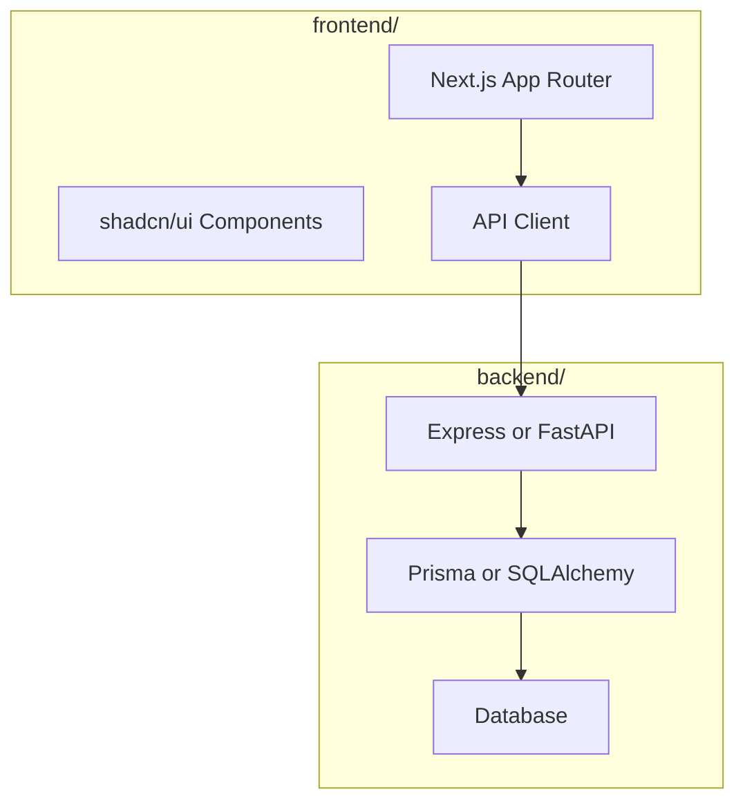
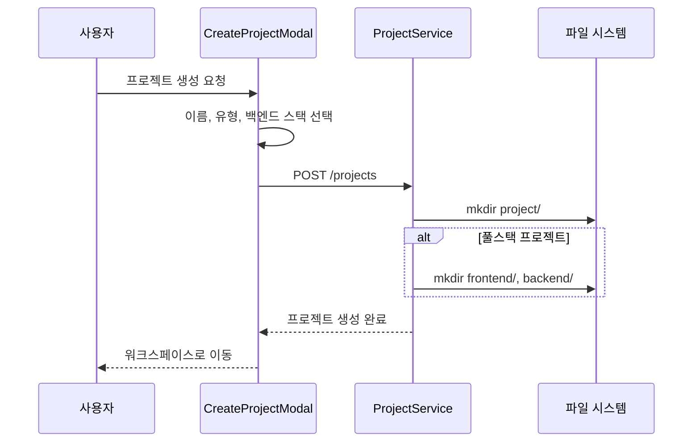
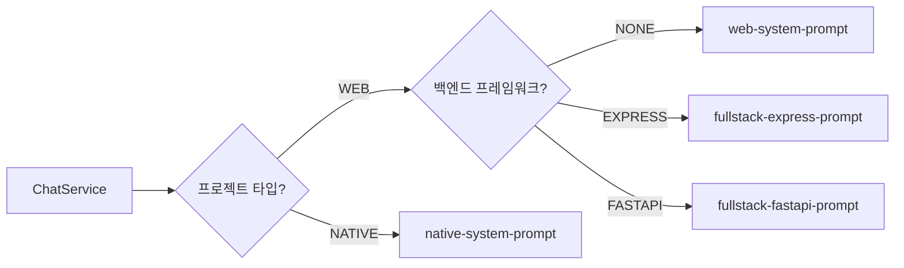
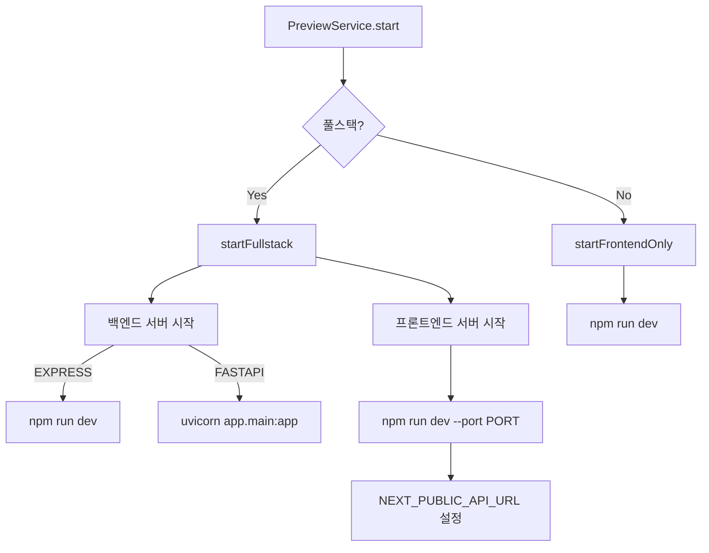

# 풀스택 앱 생성 기능 설계

> 작성일: 2025-12-29
> 버전: 1.0

---

## 1. 개요

ClaudeShip에 풀스택 앱 생성 기능을 추가합니다.

### 1.1 주요 기능

| 기능 | 설명 |
|------|------|
| **백엔드 스택 선택** | Express (Node.js) / FastAPI (Python) 선택 가능 |
| **프론트엔드** | Next.js 고정 (shadcn/ui, Tailwind CSS) |
| **파일 탐색기** | 조회 전용 트리 뷰 UI |
| **DB 연동 가이드** | SQLite/PostgreSQL 패턴 포함 |

### 1.2 프로젝트 구조



---

## 2. 기술 스택

### 2.1 프론트엔드 (공통)

| 항목 | 기술 |
|------|------|
| 프레임워크 | Next.js 15+ (App Router) |
| 언어 | TypeScript |
| UI 컴포넌트 | shadcn/ui |
| 스타일링 | Tailwind CSS |
| 상태 관리 | Zustand |

### 2.2 백엔드 옵션

| 항목 | Express (Node.js) | FastAPI (Python) |
|------|-------------------|------------------|
| 런타임 | Node.js 20+ | Python 3.11+ |
| 프레임워크 | Express 4.x | FastAPI |
| 서버 | Node.js | Uvicorn |
| ORM | Prisma | SQLAlchemy 2.0 |
| 검증 | Zod | Pydantic v2 |
| DB | SQLite/PostgreSQL | SQLite/PostgreSQL |

---

## 3. 시스템 아키텍처

### 3.1 프로젝트 생성 플로우



### 3.2 시스템 프롬프트 선택



### 3.3 프리뷰 서버 실행



---

## 4. 데이터 모델

### 4.1 BackendFramework Enum

```typescript
enum BackendFramework {
  NONE = "NONE",       // 프론트엔드 전용
  EXPRESS = "EXPRESS", // Node.js + Express
  FASTAPI = "FASTAPI", // Python + FastAPI
}
```

### 4.2 Project 모델 확장

```prisma
model Project {
  id               String           @id @default(uuid())
  name             String
  projectType      ProjectType
  backendFramework BackendFramework @default(NONE)
  path             String
  description      String?
  createdAt        DateTime         @default(now())
  updatedAt        DateTime         @updatedAt
  messages         Message[]
}
```

---

## 5. API 변경사항

### 5.1 프로젝트 생성 API

**Request:**
```json
{
  "name": "my-app",
  "projectType": "WEB",
  "backendFramework": "EXPRESS"
}
```

**Response:**
```json
{
  "id": "uuid",
  "name": "my-app",
  "projectType": "WEB",
  "backendFramework": "EXPRESS",
  "path": "/home/user/ClaudeShip-projects/my-app"
}
```

### 5.2 파일 탐색기 API (신규)

| Method | Endpoint | 설명 |
|--------|----------|------|
| GET | /projects/:id/files | 파일 트리 조회 |
| GET | /projects/:id/files/content?path= | 파일 내용 조회 |

---

## 6. UI 변경사항

### 6.1 CreateProjectModal

백엔드 스택 선택 UI 추가:

```
┌─────────────────────────────────────────┐
│  새 프로젝트 생성                         │
├─────────────────────────────────────────┤
│  프로젝트 이름: [my-app          ]        │
│                                          │
│  프로젝트 유형:                           │
│  [🌐 웹앱] [📱 네이티브 앱]                │
│                                          │
│  백엔드 스택:                             │
│  [⚡ 프론트엔드] [🟢 Express] [🐍 FastAPI] │
│     전용           (Node.js)   (Python)   │
│                                          │
│                      [취소] [생성]         │
└─────────────────────────────────────────┘
```

### 6.2 WorkspaceLayout

파일 탐색기 토글 버튼 추가:

```
┌──────────────────────────────────────────────────────────┐
│ [📁] Header                                              │
├────────┬─────────────────────┬───────────────────────────┤
│ 파일   │                     │                           │
│ 탐색기 │     채팅 패널        │       프리뷰 패널          │
│        │                     │                           │
│ 📁 app │                     │                           │
│  ├ page│                     │                           │
│  └ ...│                     │                           │
│ 📁 comp│                     │                           │
│        │                     │                           │
└────────┴─────────────────────┴───────────────────────────┘
```

---

## 7. 파일 변경 목록

### 7.1 수정 파일

| 파일 | 변경 내용 |
|------|----------|
| `packages/shared/src/types/project.ts` | BackendFramework enum 추가 |
| `apps/server/prisma/schema.prisma` | backendFramework 필드 추가 |
| `apps/server/src/project/dto/create-project.dto.ts` | DTO 필드 추가 |
| `apps/server/src/project/project.service.ts` | 풀스택 디렉토리 생성 |
| `apps/server/src/chat/chat.service.ts` | 프롬프트 선택 로직 |
| `apps/server/src/preview/preview.service.ts` | 풀스택 서버 실행 |
| `apps/server/src/app.module.ts` | FileModule import |
| `apps/web/src/components/project/CreateProjectModal.tsx` | 백엔드 선택 UI |
| `apps/web/src/components/workspace/WorkspaceLayout.tsx` | 파일 탐색기 |
| `apps/web/src/stores/useProjectStore.ts` | backendFramework 처리 |

### 7.2 신규 파일

| 파일 | 설명 |
|------|------|
| `apps/server/src/chat/prompts/fullstack-express-prompt.ts` | Express 풀스택 프롬프트 |
| `apps/server/src/chat/prompts/fullstack-fastapi-prompt.ts` | FastAPI 풀스택 프롬프트 |
| `apps/server/src/chat/prompts/index.ts` | 프롬프트 선택 로직 |
| `apps/server/src/file/file.module.ts` | 파일 모듈 |
| `apps/server/src/file/file.controller.ts` | 파일 API 컨트롤러 |
| `apps/server/src/file/file.service.ts` | 파일 서비스 |
| `apps/web/src/components/file/FileExplorer.tsx` | 파일 탐색기 UI |

---

## 8. 마이그레이션

```bash
cd apps/server
npx prisma migrate dev --name add_backend_framework
```

---

## 9. 참고 자료

- [Replit Agent 기술 스택](https://docs.replit.com/replitai/agent)
- [001-research.md](./001-research.md) - 유사 프로젝트 리서치
- [002-requirements.md](./002-requirements.md) - 요구사항 정의
