# 004. 프리뷰 기능 고도화 설계

## 개요

Replit, Lovable 수준의 프리뷰 경험을 제공하기 위한 기능 확장 설계 문서.

## 현재 상태

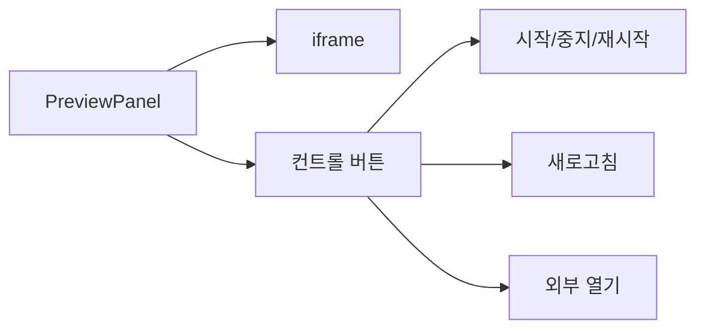

**현재 지원 기능**:
- 프리뷰 시작/중지/재시작
- 파일 변경 감지 & 자동 새로고침
- 풀스택 지원 (Express, FastAPI)

**부족한 기능**:
- 콘솔/로그 확인 불가
- 디바이스별 프리뷰 불가
- 에러 상세 정보 부족
- 환경 변수 관리 UI 없음
- DB 데이터 확인 불가

---

## Phase 1: 핵심 개선 (단기)

### 1.1 콘솔/로그 뷰어

#### 목표
프리뷰 패널에서 브라우저 콘솔과 서버 로그를 실시간으로 확인

#### 아키텍처

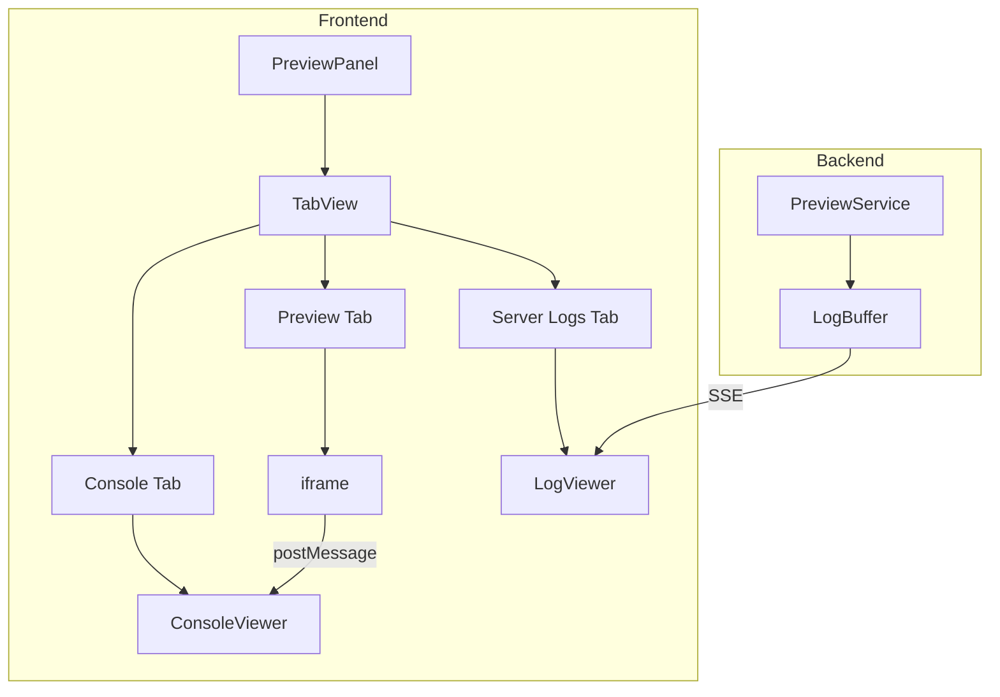

#### 구현 상세

**1. 브라우저 콘솔 캡처**

프리뷰 앱에 스크립트 주입하여 console 메서드 오버라이드:

```typescript
// 프리뷰 앱에 주입할 스크립트
const consoleScript = `
  const originalConsole = { ...console };
  ['log', 'warn', 'error', 'info'].forEach(method => {
    console[method] = (...args) => {
      originalConsole[method](...args);
      window.parent.postMessage({
        type: 'console',
        method,
        args: args.map(arg =>
          typeof arg === 'object' ? JSON.stringify(arg) : String(arg)
        ),
        timestamp: Date.now()
      }, '*');
    };
  });

  window.onerror = (msg, url, line, col, error) => {
    window.parent.postMessage({
      type: 'error',
      message: msg,
      stack: error?.stack,
      location: { url, line, col }
    }, '*');
  };
`;
```

**2. 서버 로그 스트리밍**

```typescript
// preview.service.ts 추가
interface LogEntry {
  timestamp: number;
  level: 'stdout' | 'stderr';
  source: 'frontend' | 'backend';
  message: string;
}

// 로그 버퍼 (최근 1000줄 유지)
private logBuffers: Map<string, LogEntry[]> = new Map();

// 프로세스 stdout/stderr 캡처
proc.stdout.on('data', (data) => {
  this.addLog(projectId, 'frontend', 'stdout', data.toString());
});

proc.stderr.on('data', (data) => {
  this.addLog(projectId, 'frontend', 'stderr', data.toString());
});
```

**3. SSE 로그 엔드포인트**

```typescript
// preview.controller.ts
@Get('logs')
@Sse()
streamLogs(@Param('projectId') projectId: string): Observable<MessageEvent> {
  return this.previewService.getLogStream(projectId);
}
```

#### UI 컴포넌트

```typescript
// ConsoleViewer.tsx
interface ConsoleEntry {
  id: string;
  method: 'log' | 'warn' | 'error' | 'info';
  args: string[];
  timestamp: number;
}

// 색상 코딩
const methodColors = {
  log: 'text-foreground',
  info: 'text-blue-500',
  warn: 'text-yellow-500',
  error: 'text-red-500',
};
```

#### 수정 파일

| 파일 | 변경 내용 |
|------|----------|
| `PreviewPanel.tsx` | 탭 UI 추가 (Preview, Console, Logs) |
| `ConsoleViewer.tsx` | 새 컴포넌트 생성 |
| `LogViewer.tsx` | 새 컴포넌트 생성 |
| `preview.service.ts` | 로그 버퍼 및 스트리밍 추가 |
| `preview.controller.ts` | `/logs` SSE 엔드포인트 추가 |

---

### 1.2 디바이스 프리뷰 모드

#### 목표
다양한 디바이스 크기로 반응형 디자인 확인

#### UI 설계

```
┌─────────────────────────────────────────┐
│ [🖥️] [📱] [📱↔️]  │  Preview  │ Console │
├─────────────────────────────────────────┤
│                                         │
│    ┌─────────────────────┐              │
│    │                     │              │
│    │      Preview        │              │
│    │      (375px)        │              │
│    │                     │              │
│    └─────────────────────┘              │
│                                         │
└─────────────────────────────────────────┘
```

#### 디바이스 프리셋

```typescript
const devicePresets = {
  desktop: { width: '100%', height: '100%', label: 'Desktop' },
  tablet: { width: '768px', height: '1024px', label: 'Tablet' },
  mobile: { width: '375px', height: '667px', label: 'Mobile' },
  mobileLandscape: { width: '667px', height: '375px', label: 'Mobile (가로)' },
};
```

#### 구현

```typescript
// PreviewPanel.tsx
const [device, setDevice] = useState<keyof typeof devicePresets>('desktop');

<div className="flex justify-center items-center h-full bg-muted/50 p-4">
  <iframe
    src={url}
    style={{
      width: devicePresets[device].width,
      height: devicePresets[device].height,
      maxWidth: '100%',
      maxHeight: '100%',
    }}
    className="border rounded-lg shadow-lg bg-white"
  />
</div>
```

#### 수정 파일

| 파일 | 변경 내용 |
|------|----------|
| `PreviewPanel.tsx` | 디바이스 선택 버튼 + iframe 크기 조절 |

---

### 1.3 에러 오버레이

#### 목표
컴파일/런타임 에러 발생 시 프리뷰 위에 상세 에러 정보 표시

#### 에러 유형

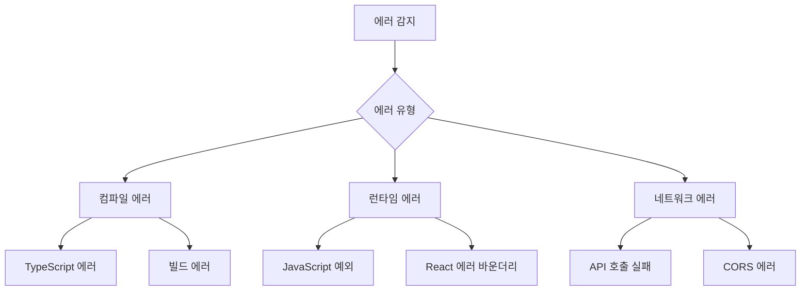

#### 에러 오버레이 UI

```
┌─────────────────────────────────────────┐
│ ❌ Compilation Error                    │
├─────────────────────────────────────────┤
│                                         │
│ TypeError: Cannot read property 'map'   │
│ of undefined                            │
│                                         │
│ ┌─────────────────────────────────────┐ │
│ │ src/components/UserList.tsx:15:23   │ │
│ │                                     │ │
│ │  14 │ export function UserList() {  │ │
│ │> 15 │   return users.map(...)       │ │
│ │     │                ^              │ │
│ │  16 │ }                             │ │
│ └─────────────────────────────────────┘ │
│                                         │
│ [Dismiss]              [Open in Editor] │
└─────────────────────────────────────────┘
```

#### 구현

```typescript
// ErrorOverlay.tsx
interface ErrorInfo {
  type: 'compile' | 'runtime' | 'network';
  message: string;
  stack?: string;
  location?: {
    file: string;
    line: number;
    column: number;
  };
  code?: string; // 에러 발생 코드 스니펫
}

// 서버 stderr에서 에러 파싱
function parseCompileError(stderr: string): ErrorInfo | null {
  // Next.js / TypeScript 에러 패턴 매칭
  const match = stderr.match(/Error: (.+)\n\s+at (.+):(\d+):(\d+)/);
  if (match) {
    return {
      type: 'compile',
      message: match[1],
      location: {
        file: match[2],
        line: parseInt(match[3]),
        column: parseInt(match[4]),
      }
    };
  }
  return null;
}
```

#### 수정 파일

| 파일 | 변경 내용 |
|------|----------|
| `ErrorOverlay.tsx` | 새 컴포넌트 생성 |
| `PreviewPanel.tsx` | 에러 상태 시 오버레이 표시 |
| `preview.service.ts` | 에러 파싱 및 이벤트 전송 |
| `usePreviewStore.ts` | 에러 상태 관리 |

---

## Phase 2: 중급 기능 (중기)

### 2.1 환경 변수 관리 UI

#### 목표
프로젝트별 환경 변수를 UI에서 관리

#### 아키텍처

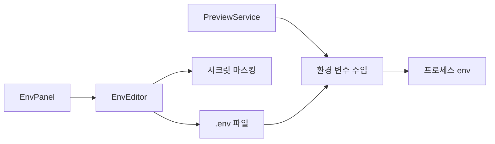

#### UI 설계

```
┌─────────────────────────────────────────┐
│ Environment Variables                   │
├─────────────────────────────────────────┤
│ KEY                  VALUE              │
│ ─────────────────────────────────────── │
│ DATABASE_URL         ••••••••••••  [👁️] │
│ API_KEY              ••••••••••••  [👁️] │
│ NEXT_PUBLIC_URL      http://...    [👁️] │
│                                         │
│ [+ Add Variable]                        │
├─────────────────────────────────────────┤
│ [Cancel]                        [Save]  │
└─────────────────────────────────────────┘
```

#### 기능

- `.env` 파일 읽기/쓰기
- 시크릿 값 마스킹 (기본 숨김, 클릭 시 표시)
- 변경 시 프리뷰 자동 재시작
- `NEXT_PUBLIC_*` 접두어 자동 제안

#### 새 파일

| 파일 | 설명 |
|------|------|
| `EnvPanel.tsx` | 환경 변수 관리 패널 |
| `env.service.ts` | .env 파일 CRUD |
| `env.controller.ts` | API 엔드포인트 |

---

### 2.2 데이터베이스 뷰어

#### 목표
Prisma/SQLite 데이터를 UI에서 확인 및 수정

#### 아키텍처

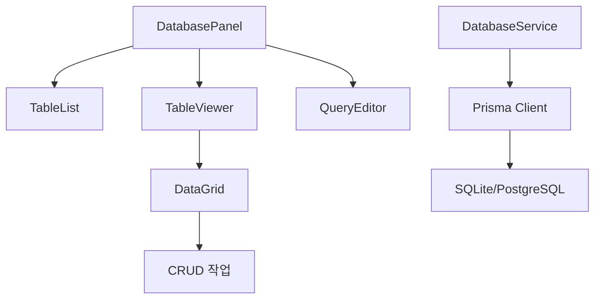

#### UI 설계

```
┌─────────────────────────────────────────────────┐
│ Database                            [🔄 Refresh]│
├──────────────┬──────────────────────────────────┤
│ Tables       │ users (24 rows)                  │
│ ──────────── │ ──────────────────────────────── │
│ > users      │ id │ name     │ email           │
│   posts      │ ───┼──────────┼─────────────────│
│   comments   │ 1  │ John     │ john@example... │
│              │ 2  │ Jane     │ jane@example... │
│              │ 3  │ Bob      │ bob@example...  │
│              │                                  │
│              │ [+ Add Row]  [Delete Selected]   │
└──────────────┴──────────────────────────────────┘
```

#### 기능

- 테이블 목록 조회
- 데이터 페이지네이션
- 행 추가/수정/삭제
- 간단한 SQL 쿼리 실행

#### 새 파일

| 파일 | 설명 |
|------|------|
| `DatabasePanel.tsx` | DB 뷰어 메인 패널 |
| `TableList.tsx` | 테이블 목록 사이드바 |
| `DataGrid.tsx` | 데이터 그리드 컴포넌트 |
| `database.service.ts` | Prisma 기반 DB 조작 |
| `database.controller.ts` | API 엔드포인트 |

---

## Phase 3: 고급 기능 (장기)

### 3.1 자동 브라우저 테스팅

#### 목표
에이전트가 실제 브라우저로 앱을 테스트하고 버그를 자동 감지

#### 아키텍처

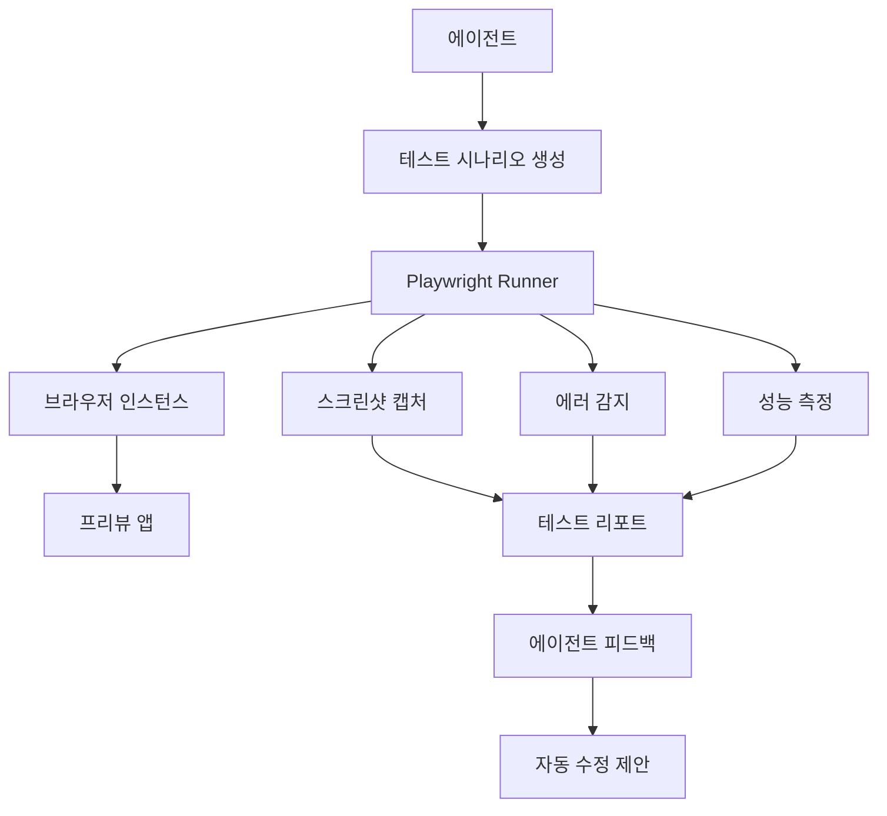

#### 테스트 시나리오 예시

```typescript
// 에이전트가 생성하는 테스트 시나리오
const testScenario = {
  name: "User Login Flow",
  steps: [
    { action: 'navigate', url: '/' },
    { action: 'click', selector: '[data-testid="login-button"]' },
    { action: 'fill', selector: 'input[name="email"]', value: 'test@example.com' },
    { action: 'fill', selector: 'input[name="password"]', value: 'password123' },
    { action: 'click', selector: 'button[type="submit"]' },
    { action: 'waitFor', selector: '[data-testid="dashboard"]' },
    { action: 'screenshot', name: 'dashboard-after-login' },
  ]
};
```

#### 새 파일

| 파일 | 설명 |
|------|------|
| `testing.service.ts` | Playwright 테스트 실행 |
| `testing.controller.ts` | 테스트 API |
| `TestRunner.tsx` | 테스트 실행 UI |
| `TestReport.tsx` | 결과 리포트 UI |

---

### 3.2 체크포인트 시스템

#### 목표
작업 상태를 자동 저장하고 원클릭 롤백 지원

#### 아키텍처

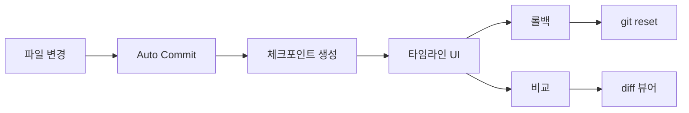

#### UI 설계

```
┌─────────────────────────────────────────┐
│ Checkpoints                             │
├─────────────────────────────────────────┤
│ ● 현재 상태                              │
│ │                                       │
│ ○ 10:35 - UserList 컴포넌트 추가         │
│ │         +3 files, -1 file             │
│ │                                       │
│ ○ 10:20 - API 엔드포인트 구현            │
│ │         +2 files                      │
│ │                                       │
│ ○ 10:05 - 초기 프로젝트 생성             │
│           +15 files                     │
│                                         │
│ [View Diff]              [Restore]      │
└─────────────────────────────────────────┘
```

#### 새 파일

| 파일 | 설명 |
|------|------|
| `checkpoint.service.ts` | Git 기반 체크포인트 관리 |
| `CheckpointPanel.tsx` | 체크포인트 타임라인 UI |
| `DiffViewer.tsx` | 변경 내용 비교 뷰어 |

---

### 3.3 비주얼 에디터

#### 목표
프리뷰에서 직접 요소를 선택하고 스타일 수정

#### 아키텍처

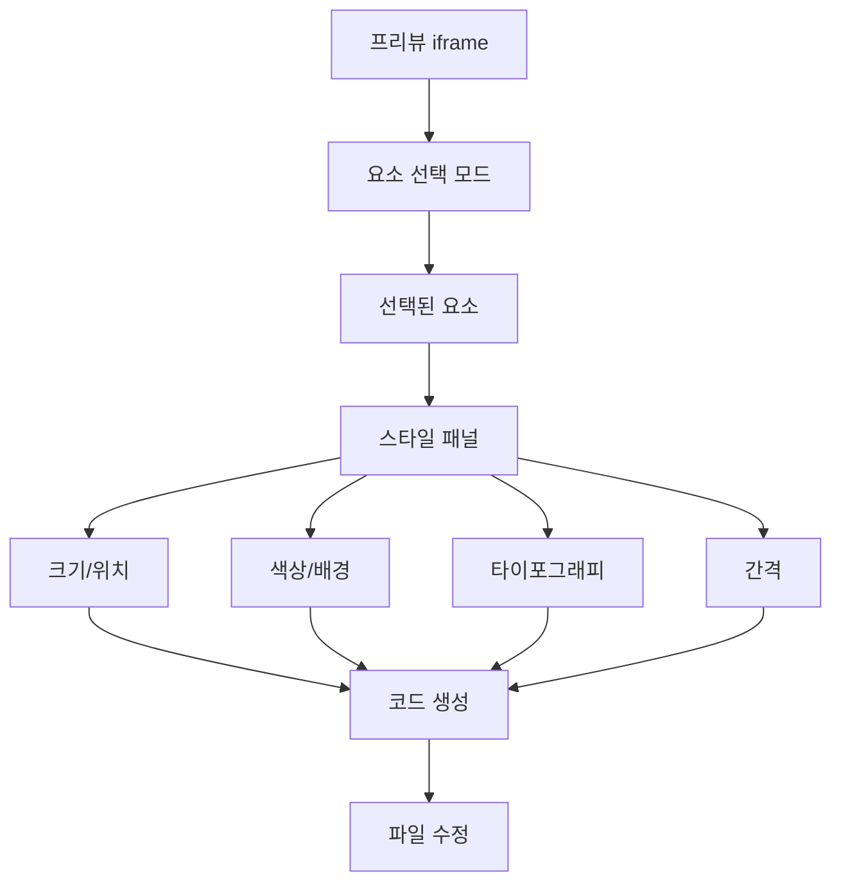

#### 기능

- 요소 호버 시 하이라이트
- 클릭으로 요소 선택
- 드래그로 크기/위치 조절
- 스타일 패널에서 속성 수정
- Tailwind 클래스 자동 생성

#### 새 파일

| 파일 | 설명 |
|------|------|
| `VisualEditor.tsx` | 비주얼 에디터 메인 |
| `ElementInspector.tsx` | 요소 검사기 |
| `StylePanel.tsx` | 스타일 수정 패널 |
| `TailwindGenerator.ts` | Tailwind 클래스 생성 |

---

## 구현 우선순위

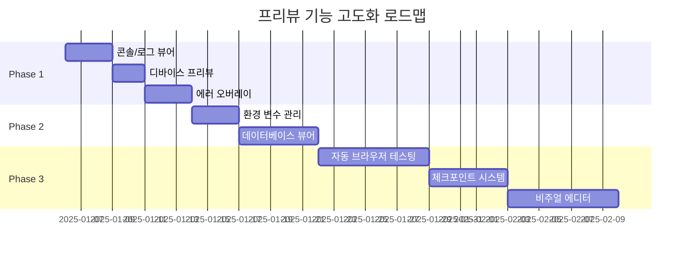

| 순위 | 기능 | 난이도 | 예상 기간 | 임팩트 |
|-----|------|-------|----------|-------|
| 1 | 콘솔/로그 뷰어 | 낮음 | 3일 | 높음 |
| 2 | 디바이스 프리뷰 | 낮음 | 2일 | 중간 |
| 3 | 에러 오버레이 | 중간 | 3일 | 높음 |
| 4 | 환경 변수 관리 | 중간 | 3일 | 중간 |
| 5 | 데이터베이스 뷰어 | 중간 | 5일 | 중간 |
| 6 | 자동 브라우저 테스팅 | 높음 | 7일 | 높음 |
| 7 | 체크포인트 시스템 | 중간 | 5일 | 중간 |
| 8 | 비주얼 에디터 | 높음 | 7일 | 높음 |

---

## 에이전트 프롬프트 전략 개선

### 현재 vs 경쟁사 비교

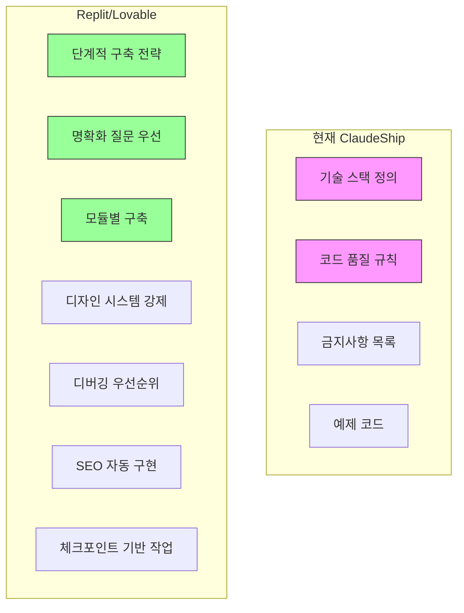

### 추가해야 할 프롬프트 전략

#### 1. 명확화 질문 우선 (Lovable 방식)

**현재**: 바로 코드 생성 시작
**개선**: 구현 전 요구사항 확인 질문

```markdown
## 요구사항 확인 프로세스

기능 구현 전에 다음을 확인하세요:

1. **목적 이해**: "이 기능의 주요 사용 사례가 무엇인가요?"
2. **범위 정의**: "어떤 페이지/컴포넌트에 적용되나요?"
3. **디자인 방향**: "어떤 스타일을 선호하시나요? (미니멀/표현적/프리미엄)"
4. **데이터 구조**: "어떤 데이터를 다루나요?"

예시 응답:
"로그인 기능을 구현하기 전에 몇 가지 확인이 필요합니다:
- 소셜 로그인(Google, GitHub)도 필요한가요?
- 비밀번호 찾기 기능이 필요한가요?
- 로그인 후 리다이렉트할 페이지가 있나요?"
```

#### 2. 단계적 구축 전략 (Replit 방식)

**현재**: 전체 앱을 한 번에 생성
**개선**: 모듈 단위로 점진적 구축

```markdown
## 점진적 구축 원칙

### 순서
1. **기본 구조 먼저**: 레이아웃, 네비게이션
2. **핵심 기능**: 주요 사용자 플로우
3. **보조 기능**: 에러 처리, 로딩 상태
4. **마무리**: 스타일 다듬기, 최적화

### 체크포인트
각 단계 완료 후:
- 현재까지 완료된 기능 요약
- 다음 단계 안내
- 사용자 피드백 요청

예시:
"## 1단계 완료: 기본 레이아웃

완료된 작업:
- ✅ 헤더/네비게이션
- ✅ 메인 레이아웃
- ✅ 푸터

다음 단계: 로그인/회원가입 기능을 구현할까요?"
```

#### 3. 컴포넌트 중심 구축 (Lovable 방식)

**현재**: 페이지 단위 생성
**개선**: 원자적 컴포넌트 단위 생성

```markdown
## 컴포넌트 우선 원칙

전체 페이지 대신 개별 섹션으로 구축:

나쁜 예:
"랜딩 페이지 전체를 만들어주세요"

좋은 예:
"다음 순서로 구축:
1. Hero 섹션 (제목, 부제, CTA 버튼)
2. 기능 소개 그리드 (3-4개 카드)
3. 고객 후기 슬라이더
4. 가격 테이블
5. FAQ 아코디언
6. 푸터"

각 컴포넌트는:
- 독립적으로 테스트 가능
- 재사용 가능한 props 구조
- 반응형 디자인 포함
```

#### 4. 디자인 시스템 강제

**현재**: 권장 사항으로만 언급
**개선**: 필수 규칙으로 강제

```markdown
## 디자인 시스템 필수 규칙

### 색상 토큰 (필수)
절대 직접 색상 사용 금지:
- ❌ `bg-blue-500`, `text-white`
- ✅ `bg-primary`, `text-primary-foreground`

모든 색상은 globals.css와 tailwind.config.ts에서 정의

### 컴포넌트 계층
1. shadcn/ui 컴포넌트 우선 사용
2. 없으면 기존 패턴 확장
3. 새 컴포넌트 생성은 최후의 수단

### 반응형 필수
모든 컴포넌트는 mobile-first:
\`\`\`tsx
// 필수 패턴
className="grid grid-cols-1 md:grid-cols-2 lg:grid-cols-3"
className="text-sm md:text-base lg:text-lg"
className="p-4 md:p-6 lg:p-8"
\`\`\`
```

#### 5. 디버깅 우선순위 명시

**현재**: 에러 처리 언급만
**개선**: 구체적인 디버깅 프로세스

```markdown
## 디버깅 프로세스

에러 발생 시 다음 순서로 확인:

1. **콘솔 로그 확인**
   - 브라우저 콘솔 에러
   - 서버 로그 에러

2. **네트워크 요청 확인**
   - API 응답 상태
   - 요청/응답 데이터

3. **코드 검토**
   - 타입 에러
   - 런타임 예외
   - 비동기 처리

4. **환경 확인**
   - 환경 변수
   - 의존성 버전

### 에러 보고 형식
"에러가 발생했습니다:
- 위치: \`src/components/UserList.tsx:15\`
- 에러: \`Cannot read property 'map' of undefined\`
- 원인: users 데이터가 로딩 전에 렌더링됨
- 해결: 로딩 상태 체크 추가"
```

#### 6. SEO 자동 구현

**현재**: 언급 없음
**개선**: 기본 SEO 자동 포함

```markdown
## SEO 기본 요소 (자동 포함)

모든 페이지에 필수 포함:

### 메타데이터
\`\`\`tsx
export const metadata: Metadata = {
  title: "페이지 제목 | 사이트명", // 60자 이하
  description: "페이지 설명", // 160자 이하
  openGraph: {
    title: "...",
    description: "...",
    images: ["/og-image.png"],
  },
};
\`\`\`

### 시맨틱 HTML
- 페이지당 하나의 `<h1>`
- 계층적 헤딩 구조 (h1 → h2 → h3)
- `<main>`, `<nav>`, `<article>`, `<section>` 사용
- 이미지에 alt 텍스트

### 접근성
- 키보드 네비게이션
- ARIA 레이블
- 색상 대비 (4.5:1 이상)
```

#### 7. 실제 콘텐츠 사용

**현재**: 예제 코드에 더미 데이터
**개선**: 실제 콘텐츠 사용 권장

```markdown
## 콘텐츠 원칙

### 더미 텍스트 금지
- ❌ "Lorem ipsum dolor sit amet"
- ❌ "Feature 1", "Feature 2"
- ❌ "Click here"

### 의미 있는 콘텐츠 사용
- ✅ 실제 기능 설명
- ✅ 명확한 CTA 텍스트
- ✅ 현실적인 예시 데이터

### 예시
\`\`\`tsx
// 나쁜 예
<Button>Click here</Button>
<Card title="Feature 1" description="Lorem ipsum..." />

// 좋은 예
<Button>지금 시작하기</Button>
<Card
  title="실시간 협업"
  description="팀원들과 동시에 문서를 편집하고 변경사항을 즉시 확인하세요."
/>
\`\`\`
```

#### 8. 프로젝트 컨텍스트 파일

**현재**: 없음
**개선**: replit.md / CLAUDE.md 스타일 프로젝트 설정

```markdown
## 프로젝트 컨텍스트 (PROJECT.md)

각 프로젝트에 PROJECT.md 파일 생성:

\`\`\`markdown
# 프로젝트명

## 개요
[프로젝트 설명]

## 기술 스택
- Frontend: Next.js 15, TypeScript, Tailwind CSS
- Backend: Express, Prisma, SQLite
- 인증: NextAuth.js

## 디자인 방향
- 스타일: 미니멀, 클린
- 색상: 블루 계열 primary
- 톤: 전문적, 신뢰감

## 핵심 기능
1. 사용자 인증
2. 대시보드
3. ...

## 코딩 컨벤션
- 컴포넌트: PascalCase
- 함수: camelCase
- 파일: kebab-case

## 에이전트 지시사항
- 한글로 응답
- 각 단계마다 확인 요청
- ...
\`\`\`
```

### 프롬프트 개선 요약

| 항목 | 현재 | 개선 |
|------|------|------|
| 요구사항 확인 | 바로 구현 | 질문 먼저 |
| 구축 방식 | 한 번에 전체 | 단계적 모듈 |
| 디자인 시스템 | 권장 | 강제 |
| 디버깅 | 언급만 | 프로세스 명시 |
| SEO | 없음 | 자동 포함 |
| 콘텐츠 | 더미 허용 | 실제 콘텐츠 |
| 프로젝트 설정 | 없음 | PROJECT.md |
| 체크포인트 | 없음 | 단계별 확인 |

### 새 시스템 프롬프트 구조

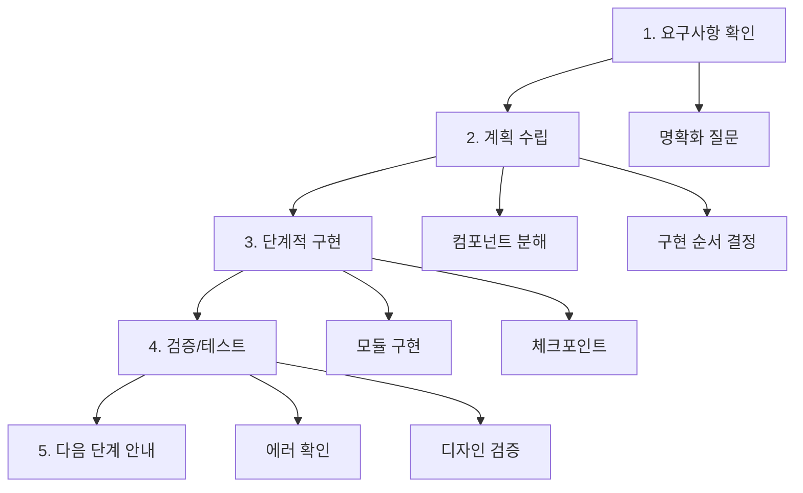

---

## 구현 파일 목록

### 프롬프트 수정

| 파일 | 변경 내용 |
|------|----------|
| `web-system-prompt.ts` | 명확화 질문, 단계적 구축, SEO 섹션 추가 |
| `fullstack-express-prompt.ts` | 동일한 전략 적용 |
| `fullstack-fastapi-prompt.ts` | 동일한 전략 적용 |

### 새 기능

| 파일 | 설명 |
|------|------|
| `project-context.service.ts` | PROJECT.md 읽기/생성 |
| `project-context.controller.ts` | 컨텍스트 API |

---

## 참고 자료

- [Replit Agent Documentation](https://docs.replit.com/replitai/agent)
- [Replit Effective Prompting](https://docs.replit.com/tutorials/effective-prompting)
- [Lovable Prompting Guide](https://docs.lovable.dev/prompting/prompting-one)
- [Lovable Prompting Bible](https://lovable.dev/blog/2025-01-16-lovable-prompting-handbook)
- [Lovable System Prompt](https://github.com/x1xhlol/system-prompts-and-models-of-ai-tools/blob/main/Lovable/Agent%20Prompt.txt)
- [Playwright Documentation](https://playwright.dev/)
- [Prisma Studio](https://www.prisma.io/studio)
