# 백엔드 기능 설계서

> 작성일: 2025-12-29
> 버전: 1.1 (기술 검증 결과 반영)

---

## 1. 개요

### 1.1 목적

ClaudeShip 백엔드의 기능 설계를 정의합니다.

### 1.2 기술 스택

| 항목 | 기술 |
|------|------|
| 프레임워크 | NestJS |
| 언어 | TypeScript |
| 실시간 통신 | SSE (Server-Sent Events) |
| 프로세스 관리 | Node.js child_process |
| 데이터 저장 | SQLite (개발) / PostgreSQL (프로덕션) |
| ORM | Prisma |
| 프록시 | http-proxy-middleware (프리뷰용) |

---

## 2. 시스템 아키텍처

### 2.1 전체 구조

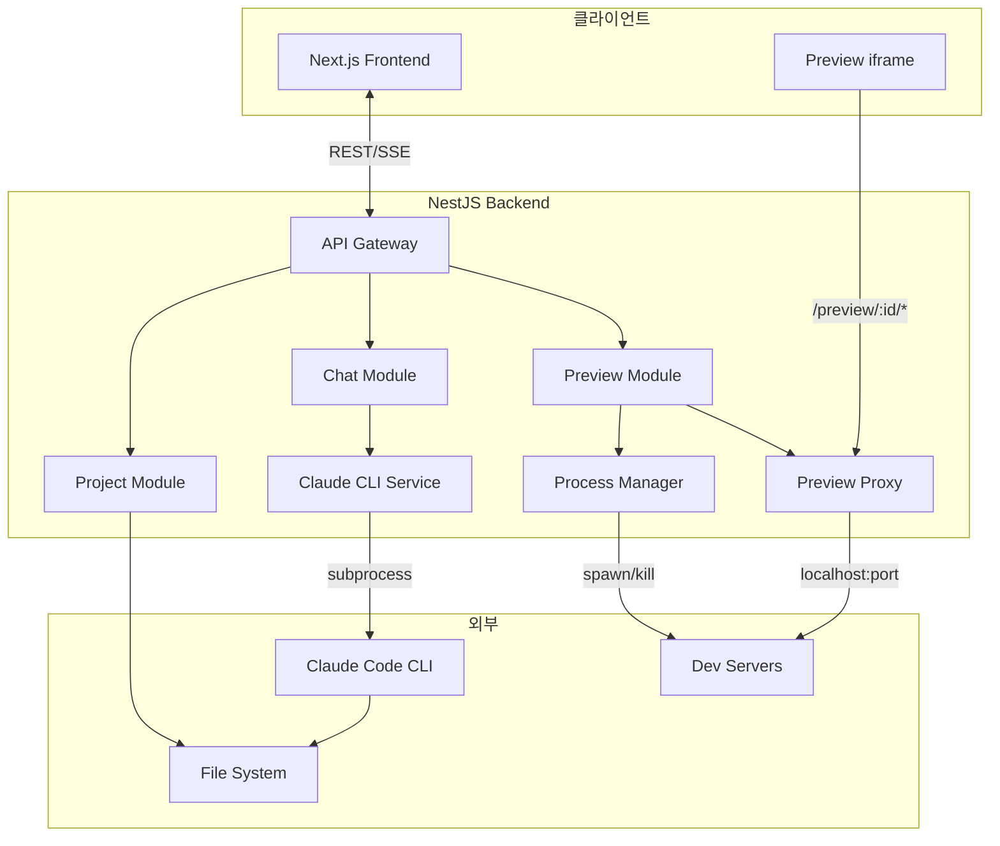

> **Note**: 프리뷰는 프록시를 경유하여 CORS 및 HMR 이슈를 해결합니다.

### 2.2 모듈 구조

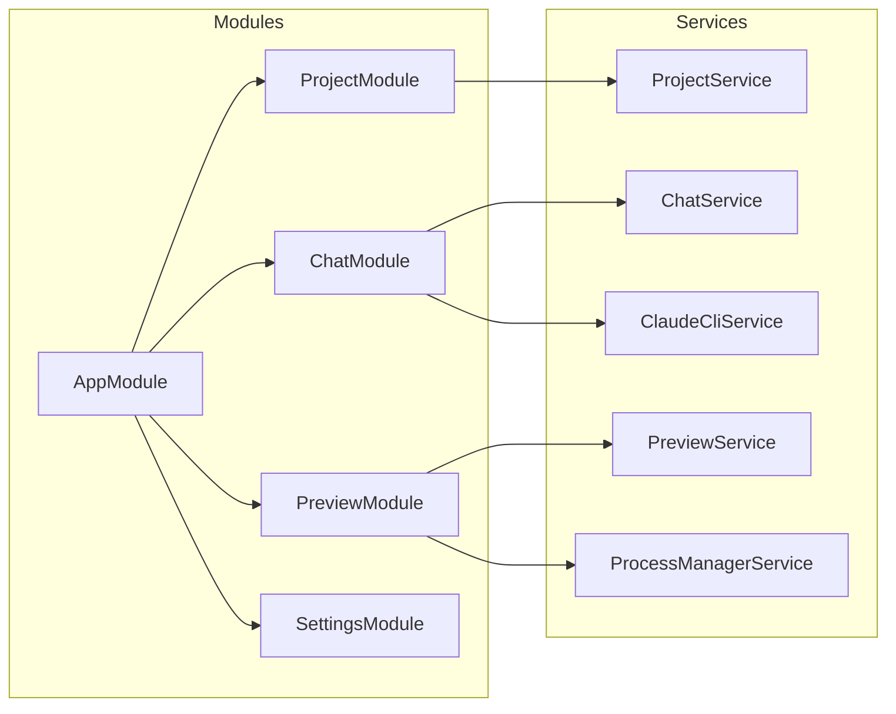

---

## 3. 사용자 시나리오 (백엔드 관점)

### 3.1 시나리오 1: 프로젝트 생성

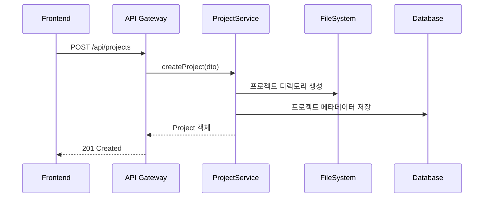

### 3.2 시나리오 2: 채팅 메시지 처리 (핵심)

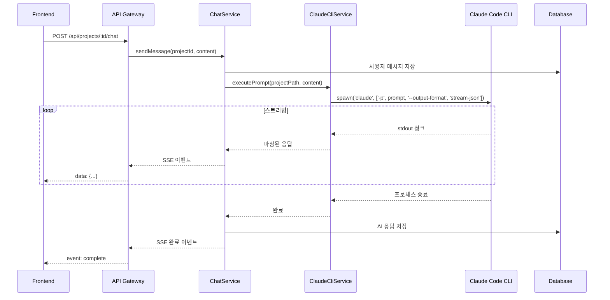

### 3.3 시나리오 3: 프리뷰 시작

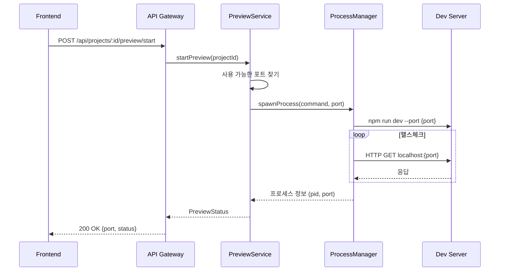

### 3.4 시나리오 4: 프리뷰 중지

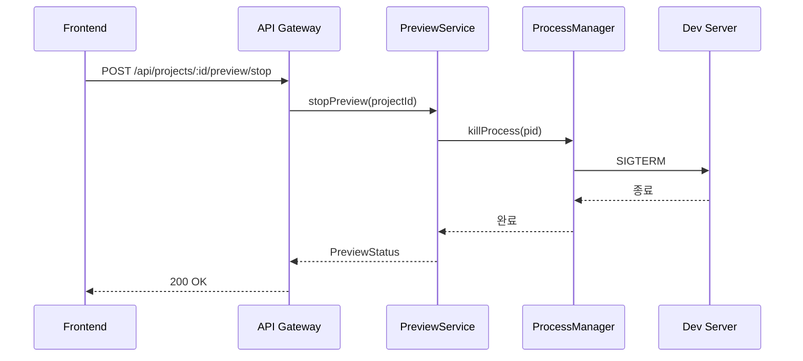

---

## 4. 모듈 상세 설계

### 4.1 디렉토리 구조

```
apps/server/
├── src/
│   ├── main.ts                    # 엔트리포인트
│   ├── app.module.ts              # 루트 모듈
│   │
│   ├── common/
│   │   ├── filters/               # 예외 필터
│   │   ├── interceptors/          # 인터셉터
│   │   ├── pipes/                 # 파이프
│   │   └── guards/                # 가드
│   │
│   ├── project/
│   │   ├── project.module.ts
│   │   ├── project.controller.ts
│   │   ├── project.service.ts
│   │   ├── dto/
│   │   │   ├── create-project.dto.ts
│   │   │   └── project-response.dto.ts
│   │   └── entities/
│   │       └── project.entity.ts
│   │
│   ├── chat/
│   │   ├── chat.module.ts
│   │   ├── chat.controller.ts
│   │   ├── chat.service.ts
│   │   ├── claude-cli.service.ts  # Claude Code CLI 래퍼
│   │   ├── dto/
│   │   │   ├── send-message.dto.ts
│   │   │   └── message-response.dto.ts
│   │   └── entities/
│   │       └── message.entity.ts
│   │
│   ├── preview/
│   │   ├── preview.module.ts
│   │   ├── preview.controller.ts
│   │   ├── preview.service.ts
│   │   ├── process-manager.service.ts
│   │   └── dto/
│   │       └── preview-status.dto.ts
│   │
│   └── settings/
│       ├── settings.module.ts
│       ├── settings.controller.ts
│       └── settings.service.ts
│
├── prisma/
│   └── schema.prisma
│
└── test/
    └── ...
```

### 4.2 Project 모듈

#### Controller

```typescript
@Controller('api/projects')
export class ProjectController {
  @Get()
  findAll(): Promise<Project[]>

  @Post()
  create(@Body() dto: CreateProjectDto): Promise<Project>

  @Get(':id')
  findOne(@Param('id') id: string): Promise<Project>

  @Delete(':id')
  remove(@Param('id') id: string): Promise<void>
}
```

#### Service

```typescript
@Injectable()
export class ProjectService {
  // 프로젝트 목록 조회
  async findAll(): Promise<Project[]>

  // 프로젝트 생성
  // - DB에 메타데이터 저장
  // - 프로젝트 디렉토리 생성
  async create(dto: CreateProjectDto): Promise<Project>

  // 프로젝트 조회
  async findOne(id: string): Promise<Project>

  // 프로젝트 삭제
  // - DB에서 삭제
  // - 디렉토리 삭제 (옵션)
  async remove(id: string): Promise<void>

  // 프로젝트 경로 조회
  getProjectPath(id: string): string
}
```

#### DTO

```typescript
// create-project.dto.ts
export class CreateProjectDto {
  @IsString()
  @MinLength(1)
  name: string;

  @IsEnum(Framework)
  framework: Framework;

  @IsOptional()
  @IsString()
  description?: string;
}

// project-response.dto.ts
export class ProjectResponseDto {
  id: string;
  name: string;
  framework: Framework;
  path: string;
  createdAt: Date;
  updatedAt: Date;
}
```

### 4.3 Chat 모듈

#### Controller

```typescript
@Controller('api/projects/:projectId')
export class ChatController {
  // 채팅 메시지 전송 (SSE 응답)
  @Post('chat')
  @Sse()
  sendMessage(
    @Param('projectId') projectId: string,
    @Body() dto: SendMessageDto,
  ): Observable<MessageEvent>

  // 채팅 히스토리 조회
  @Get('messages')
  getMessages(
    @Param('projectId') projectId: string,
    @Query() query: GetMessagesQueryDto,
  ): Promise<Message[]>
}
```

#### ChatService

```typescript
@Injectable()
export class ChatService {
  constructor(
    private claudeCliService: ClaudeCliService,
    private prisma: PrismaService,
  ) {}

  // 메시지 전송 및 AI 응답 스트리밍
  sendMessage(
    projectId: string,
    content: string,
  ): Observable<StreamEvent> {
    return new Observable((subscriber) => {
      // 1. 사용자 메시지 저장
      // 2. Claude CLI 실행
      // 3. 스트리밍 응답 전달
      // 4. 완료 시 AI 응답 저장
    });
  }

  // 메시지 히스토리 조회
  async getMessages(projectId: string): Promise<Message[]>
}
```

#### ClaudeCliService (핵심)

```typescript
@Injectable()
export class ClaudeCliService {
  private readonly cliPath: string;

  constructor(private configService: ConfigService) {
    this.cliPath = configService.get('CLAUDE_CLI_PATH', 'claude');
  }

  // Claude CLI 실행 및 스트리밍
  executePrompt(
    projectPath: string,
    prompt: string,
  ): Observable<ClaudeStreamEvent> {
    return new Observable((subscriber) => {
      const args = [
        '-p', prompt,
        '--output-format', 'stream-json',
        '--dangerously-skip-permissions', // 또는 적절한 권한 설정
      ];

      const process = spawn(this.cliPath, args, {
        cwd: projectPath,
        env: { ...process.env },
      });

      let buffer = '';

      process.stdout.on('data', (data) => {
        buffer += data.toString();
        // 줄 단위로 파싱
        const lines = buffer.split('\n');
        buffer = lines.pop() || '';

        for (const line of lines) {
          if (line.trim()) {
            try {
              const event = JSON.parse(line);
              subscriber.next(this.parseEvent(event));
            } catch (e) {
              // 파싱 실패 시 텍스트로 처리
              subscriber.next({ type: 'text', content: line });
            }
          }
        }
      });

      process.stderr.on('data', (data) => {
        subscriber.next({ type: 'error', content: data.toString() });
      });

      process.on('close', (code) => {
        if (code === 0) {
          subscriber.complete();
        } else {
          subscriber.error(new Error(`Process exited with code ${code}`));
        }
      });

      // 정리 함수
      return () => {
        if (!process.killed) {
          process.kill('SIGTERM');
        }
      };
    });
  }

  // CLI 설치 확인
  async checkInstallation(): Promise<boolean>

  // 이벤트 파싱
  private parseEvent(raw: any): ClaudeStreamEvent
}
```

### 4.4 Preview 모듈

#### Controller

```typescript
@Controller('api/projects/:projectId/preview')
export class PreviewController {
  @Post('start')
  start(@Param('projectId') projectId: string): Promise<PreviewStatusDto>

  @Post('stop')
  stop(@Param('projectId') projectId: string): Promise<PreviewStatusDto>

  @Get('status')
  getStatus(@Param('projectId') projectId: string): Promise<PreviewStatusDto>
}
```

#### PreviewService

```typescript
@Injectable()
export class PreviewService {
  // 실행 중인 프리뷰 정보
  private previews: Map<string, PreviewInfo> = new Map();

  constructor(
    private processManager: ProcessManagerService,
    private projectService: ProjectService,
  ) {}

  // 프리뷰 시작
  async start(projectId: string): Promise<PreviewStatus> {
    // 1. 이미 실행 중인지 확인
    // 2. 프로젝트 경로 조회
    // 3. 사용 가능한 포트 할당
    // 4. Dev server 프로세스 시작
    // 5. 헬스체크 후 상태 반환
  }

  // 프리뷰 중지
  async stop(projectId: string): Promise<PreviewStatus>

  // 상태 조회
  async getStatus(projectId: string): Promise<PreviewStatus>

  // 사용 가능한 포트 찾기
  private async findAvailablePort(): Promise<number>
}
```

#### ProcessManagerService

```typescript
@Injectable()
export class ProcessManagerService {
  private processes: Map<string, ChildProcess> = new Map();

  // 프로세스 시작
  spawn(
    id: string,
    command: string,
    args: string[],
    options: SpawnOptions,
  ): ChildProcess {
    const proc = spawn(command, args, options);
    this.processes.set(id, proc);

    proc.on('exit', () => {
      this.processes.delete(id);
    });

    return proc;
  }

  // 프로세스 종료
  kill(id: string): boolean {
    const proc = this.processes.get(id);
    if (proc && !proc.killed) {
      proc.kill('SIGTERM');
      return true;
    }
    return false;
  }

  // 프로세스 상태 확인
  isRunning(id: string): boolean

  // 모든 프로세스 종료 (앱 종료 시)
  killAll(): void
}
```

---

## 5. API 명세

### 5.1 Project API

| Method | Endpoint | 설명 | Request | Response |
|--------|----------|------|---------|----------|
| GET | /api/projects | 목록 조회 | - | Project[] |
| POST | /api/projects | 생성 | CreateProjectDto | Project |
| GET | /api/projects/:id | 상세 조회 | - | Project |
| DELETE | /api/projects/:id | 삭제 | - | 204 |

### 5.2 Chat API

| Method | Endpoint | 설명 | Request | Response |
|--------|----------|------|---------|----------|
| POST | /api/projects/:id/chat | 메시지 전송 | SendMessageDto | SSE Stream |
| GET | /api/projects/:id/messages | 히스토리 | ?limit&offset | Message[] |

#### SSE 이벤트 형식

```typescript
// 텍스트 청크
event: message
data: {"type": "text", "content": "코드를 작성하겠습니다..."}

// 도구 사용
event: message
data: {"type": "tool_use", "tool": "write_file", "path": "src/app.tsx"}

// 도구 결과
event: message
data: {"type": "tool_result", "tool": "write_file", "success": true}

// 완료
event: complete
data: {"messageId": "msg_123"}

// 에러
event: error
data: {"message": "Claude CLI 실행 실패"}
```

### 5.3 Preview API

| Method | Endpoint | 설명 | Request | Response |
|--------|----------|------|---------|----------|
| POST | /api/projects/:id/preview/start | 시작 | - | PreviewStatus |
| POST | /api/projects/:id/preview/stop | 중지 | - | PreviewStatus |
| GET | /api/projects/:id/preview/status | 상태 | - | PreviewStatus |

#### PreviewStatus 형식

```typescript
interface PreviewStatus {
  status: 'stopped' | 'starting' | 'running' | 'error';
  port?: number;
  url?: string;
  error?: string;
  pid?: number;
}
```

### 5.4 Settings API

| Method | Endpoint | 설명 | Request | Response |
|--------|----------|------|---------|----------|
| GET | /api/settings | 설정 조회 | - | Settings |
| PUT | /api/settings | 설정 수정 | UpdateSettingsDto | Settings |
| GET | /api/settings/cli-status | CLI 상태 | - | CliStatus |

---

## 6. 데이터 모델

### 6.1 Prisma Schema

```prisma
// prisma/schema.prisma

generator client {
  provider = "prisma-client-js"
}

datasource db {
  provider = "sqlite"  // 개발
  // provider = "postgresql"  // 프로덕션
  url      = env("DATABASE_URL")
}

model Project {
  id          String    @id @default(uuid())
  name        String
  framework   Framework
  path        String
  description String?
  createdAt   DateTime  @default(now())
  updatedAt   DateTime  @updatedAt

  messages    Message[]

  @@map("projects")
}

model Message {
  id        String   @id @default(uuid())
  projectId String
  role      Role
  content   String
  metadata  Json?
  createdAt DateTime @default(now())

  project   Project  @relation(fields: [projectId], references: [id], onDelete: Cascade)

  @@map("messages")
}

enum Framework {
  NEXTJS
  REACT_NATIVE
}

enum Role {
  USER
  ASSISTANT
  SYSTEM
}
```

### 6.2 엔티티 관계

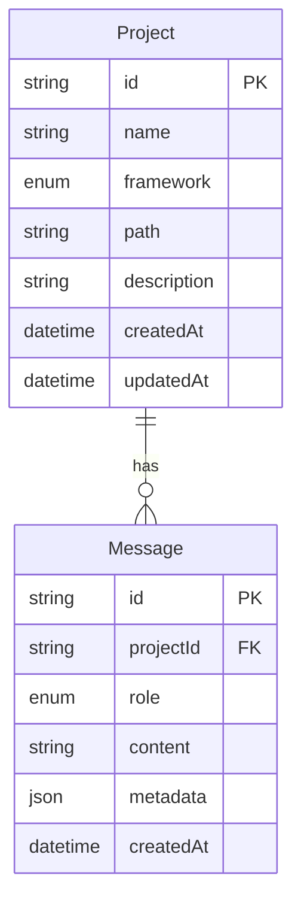

---

## 7. 기능 요구사항

### 7.1 프로젝트 관리

| ID | 기능 | 설명 | 우선순위 |
|----|------|------|----------|
| BP-01 | 프로젝트 생성 | 디렉토리 생성 + DB 저장 | P0 |
| BP-02 | 프로젝트 목록 | 전체 프로젝트 조회 | P0 |
| BP-03 | 프로젝트 삭제 | DB 삭제 + 디렉토리 삭제(옵션) | P0 |
| BP-04 | 프로젝트 경로 관리 | 설정 가능한 베이스 경로 | P1 |

### 7.2 채팅 (Claude CLI)

| ID | 기능 | 설명 | 우선순위 |
|----|------|------|----------|
| BC-01 | CLI 실행 | subprocess로 claude 실행 | P0 |
| BC-02 | 스트리밍 응답 | stdout 실시간 파싱 | P0 |
| BC-03 | SSE 전송 | 클라이언트에 실시간 전달 | P0 |
| BC-04 | 메시지 저장 | 사용자/AI 메시지 DB 저장 | P0 |
| BC-05 | 히스토리 조회 | 페이지네이션 지원 | P0 |
| BC-06 | 에러 핸들링 | CLI 에러, 타임아웃 처리 | P1 |
| BC-07 | 프로세스 관리 | 실행 중인 CLI 추적/종료 | P1 |

### 7.3 프리뷰

| ID | 기능 | 설명 | 우선순위 |
|----|------|------|----------|
| BV-01 | Dev server 시작 | 프레임워크별 명령 실행 | P0 |
| BV-02 | Dev server 중지 | 프로세스 종료 | P0 |
| BV-03 | 상태 조회 | 실행 상태, 포트 정보 | P0 |
| BV-04 | 포트 관리 | 동적 포트 할당 | P0 |
| BV-05 | 헬스체크 | 서버 준비 상태 확인 | P1 |
| BV-06 | 자동 재시작 | 크래시 시 재시작 | P2 |

### 7.4 설정

| ID | 기능 | 설명 | 우선순위 |
|----|------|------|----------|
| BS-01 | CLI 경로 설정 | claude 명령어 경로 | P1 |
| BS-02 | CLI 상태 확인 | 설치/버전 확인 | P0 |
| BS-03 | 프로젝트 베이스 경로 | 저장 위치 설정 | P1 |
| BS-04 | 포트 범위 설정 | 프리뷰 포트 범위 | P2 |

---

## 8. 개발 계획

### 8.1 Phase 1: 기본 구조

```mermaid
gantt
    title Phase 1: 기본 구조
    dateFormat X
    axisFormat %s

    section 프로젝트 설정
    NestJS 초기화          :p1, 0, 1
    Prisma 설정            :p2, after p1, 1
    기본 모듈 구조          :p3, after p2, 1

    section Project 모듈
    Controller             :m1, after p3, 1
    Service                :m2, after m1, 1
    DTO/Entity             :m3, after m2, 1
```

**완료 조건:**
- [ ] NestJS 프로젝트 초기화
- [ ] Prisma + SQLite 연동
- [ ] Project CRUD API

### 8.2 Phase 2: Claude CLI 연동

```mermaid
gantt
    title Phase 2: Claude CLI 연동
    dateFormat X
    axisFormat %s

    section CLI 서비스
    ClaudeCliService       :c1, 0, 2
    스트리밍 파싱          :c2, after c1, 1
    에러 핸들링            :c3, after c2, 1

    section Chat 모듈
    Controller (SSE)       :m1, after c3, 1
    ChatService            :m2, after m1, 1
    메시지 저장            :m3, after m2, 1
```

**완료 조건:**
- [ ] Claude CLI subprocess 실행
- [ ] stream-json 파싱
- [ ] SSE 스트리밍 응답
- [ ] 메시지 DB 저장

### 8.3 Phase 3: 프리뷰 시스템

```mermaid
gantt
    title Phase 3: 프리뷰 시스템
    dateFormat X
    axisFormat %s

    section 프로세스 관리
    ProcessManagerService  :p1, 0, 1
    포트 관리              :p2, after p1, 1

    section Preview 모듈
    Controller             :m1, after p2, 1
    PreviewService         :m2, after m1, 1
    헬스체크               :m3, after m2, 1
```

**완료 조건:**
- [ ] Dev server 시작/중지
- [ ] 동적 포트 할당
- [ ] 상태 조회 API

### 8.4 Phase 4: 마무리

```mermaid
gantt
    title Phase 4: 마무리
    dateFormat X
    axisFormat %s

    section 설정
    Settings 모듈          :s1, 0, 1
    CLI 상태 확인          :s2, after s1, 1

    section 안정화
    에러 핸들링            :e1, after s2, 1
    로깅                   :e2, after e1, 1
    테스트                 :e3, after e2, 1
```

**완료 조건:**
- [ ] 설정 API
- [ ] 전역 에러 핸들링
- [ ] 로깅 시스템
- [ ] 단위 테스트

---

## 9. 기술 고려사항 (검증 완료)

### 9.1 Claude CLI 스트리밍 파싱

**실행 명령:**
```bash
claude -p "prompt" --output-format stream-json --verbose
```

**실제 출력 형식 (검증됨):**

```typescript
// 1. 초기화 메시지
{
  "type": "system",
  "subtype": "init",
  "cwd": "/project/path",
  "session_id": "uuid",
  "tools": ["Task", "Bash", "Write", "Edit", ...],
  "model": "claude-opus-4-5",
  "claude_code_version": "2.0.76"
}

// 2. AI 응답 (텍스트)
{
  "type": "assistant",
  "message": {
    "model": "claude-opus-4-5-20251101",
    "content": [{"type": "text", "text": "안녕하세요!"}],
    "usage": {"input_tokens": 2, "output_tokens": 8}
  },
  "session_id": "uuid"
}

// 3. AI 응답 (도구 사용)
{
  "type": "assistant",
  "message": {
    "content": [{
      "type": "tool_use",
      "id": "toolu_xxx",
      "name": "Write",
      "input": {"file_path": "/path/to/file", "content": "..."}
    }]
  }
}

// 4. 도구 결과 (권한 필요 시)
{
  "type": "user",
  "message": {
    "content": [{
      "type": "tool_result",
      "content": "Claude requested permissions to write...",
      "is_error": true,
      "tool_use_id": "toolu_xxx"
    }]
  },
  "tool_use_result": "Error: ..."
}

// 5. 완료
{
  "type": "result",
  "subtype": "success",
  "is_error": false,
  "duration_ms": 4877,
  "result": "최종 결과 텍스트",
  "total_cost_usd": 0.055,
  "usage": {...}
}
```

### 9.2 권한 처리 방식

**설정에서 선택 가능한 두 가지 모드:**

| 모드 | 옵션 | 설명 |
|------|------|------|
| **자동 승인** | `--dangerously-skip-permissions` | 모든 권한 자동 허용 (프로젝트 폴더 내) |
| **사용자 확인** | Hooks 시스템 | 권한 요청 시 UI에서 승인/거부 |

**Hooks 시스템 (사용자 확인 모드):**

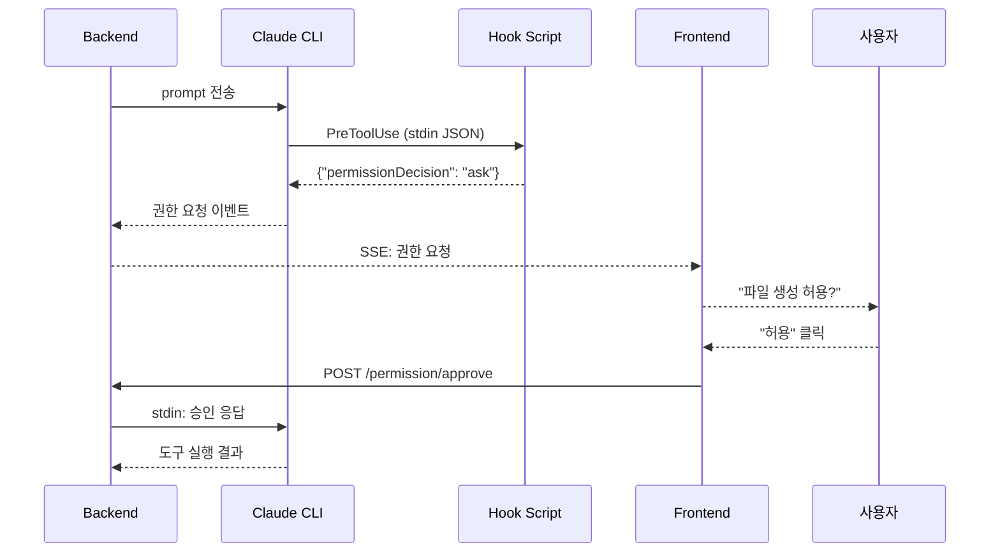

**Hook 스크립트 응답 형식:**
```json
{
  "hookSpecificOutput": {
    "hookEventName": "PreToolUse",
    "permissionDecision": "allow" | "deny" | "ask",
    "permissionDecisionReason": "사유"
  }
}
```

### 9.3 SSE 구현 (NestJS)

```typescript
import { Sse, MessageEvent } from '@nestjs/common';
import { Observable } from 'rxjs';

@Sse('chat')
sendMessage(@Body() dto: SendMessageDto): Observable<MessageEvent> {
  return this.chatService.sendMessage(dto).pipe(
    map((event) => ({
      data: event,
    })),
  );
}
```

### 9.4 프리뷰 프록시 시스템

**문제점:**
- iframe에서 다른 포트의 Dev Server 직접 접근 시 CORS 이슈
- WebSocket 기반 HMR (Hot Module Replacement) 연결 실패
- 보안상 내부 포트 직접 노출 방지 필요

**해결책: 프록시 경유 방식**

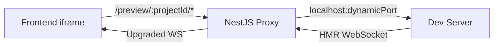

**구현:**

```typescript
// preview.middleware.ts
import { createProxyMiddleware } from 'http-proxy-middleware';

@Injectable()
export class PreviewProxyMiddleware implements NestMiddleware {
  constructor(private previewService: PreviewService) {}

  use(req: Request, res: Response, next: NextFunction) {
    const projectId = req.params.projectId;
    const preview = this.previewService.getPreview(projectId);

    if (!preview || preview.status !== 'running') {
      return res.status(404).json({ error: 'Preview not running' });
    }

    const proxy = createProxyMiddleware({
      target: `http://localhost:${preview.port}`,
      changeOrigin: true,
      ws: true, // WebSocket 지원 (HMR)
      pathRewrite: {
        [`^/preview/${projectId}`]: '',
      },
    });

    return proxy(req, res, next);
  }
}
```

**라우팅 설정:**

```typescript
// app.module.ts
export class AppModule implements NestModule {
  configure(consumer: MiddlewareConsumer) {
    consumer
      .apply(PreviewProxyMiddleware)
      .forRoutes('/preview/:projectId/*');
  }
}
```

**프론트엔드 iframe URL:**
```
// 기존 (CORS 문제)
http://localhost:3001  (Dev Server 직접)

// 변경 (프록시 경유)
http://localhost:4000/preview/{projectId}/  (NestJS 프록시)
```

### 9.5 프로세스 정리

```typescript
// 앱 종료 시 모든 프로세스 정리
@Module({})
export class AppModule implements OnModuleDestroy {
  constructor(private processManager: ProcessManagerService) {}

  onModuleDestroy() {
    this.processManager.killAll();
  }
}
```

### 9.6 보안 고려사항

| 위험 | 대응 |
|------|------|
| 경로 탐색 공격 | 프로젝트 경로 화이트리스트 |
| 명령 주입 | 사용자 입력 직접 CLI에 전달하지 않음 |
| 포트 스캔 | 허용 포트 범위 제한 |
| 리소스 고갈 | 동시 프로세스 수 제한 |

---

## 10. 참고

- [002-requirements.md](../002-requirements.md) - 요구사항 정의서
- [frontend/001-feature-design.md](../frontend/001-feature-design.md) - 프론트엔드 설계
- [NestJS 문서](https://docs.nestjs.com/)
- [Prisma 문서](https://www.prisma.io/docs/)
