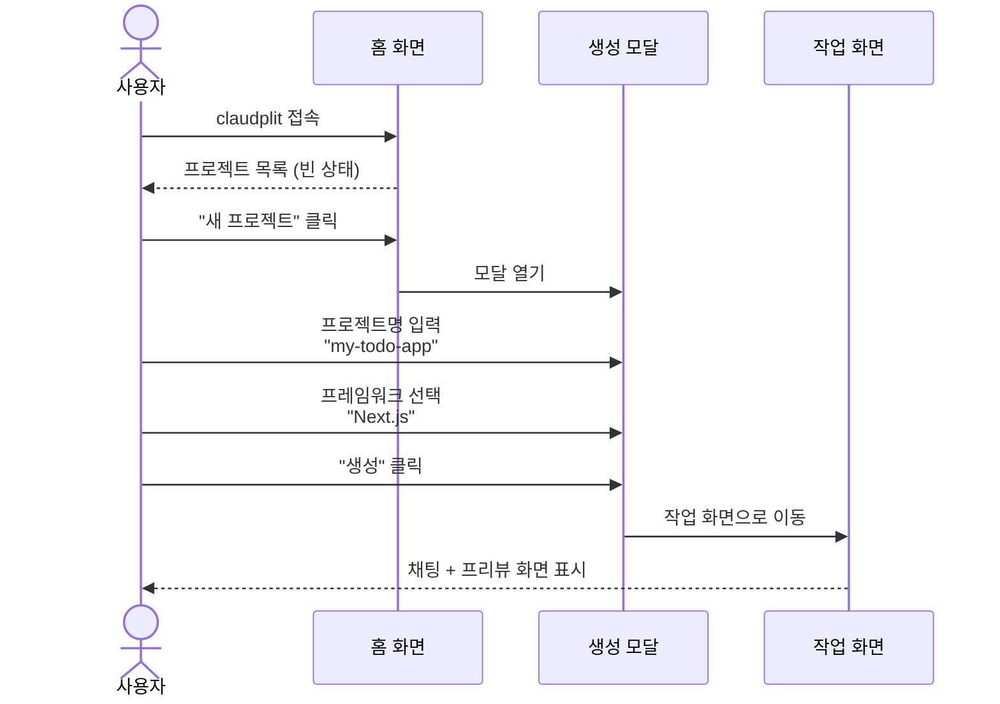
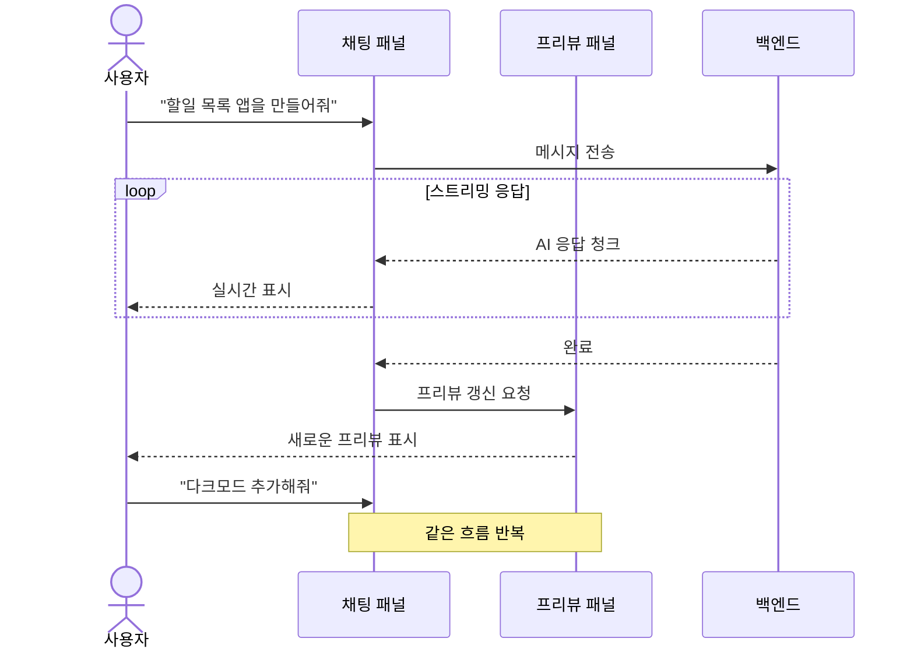
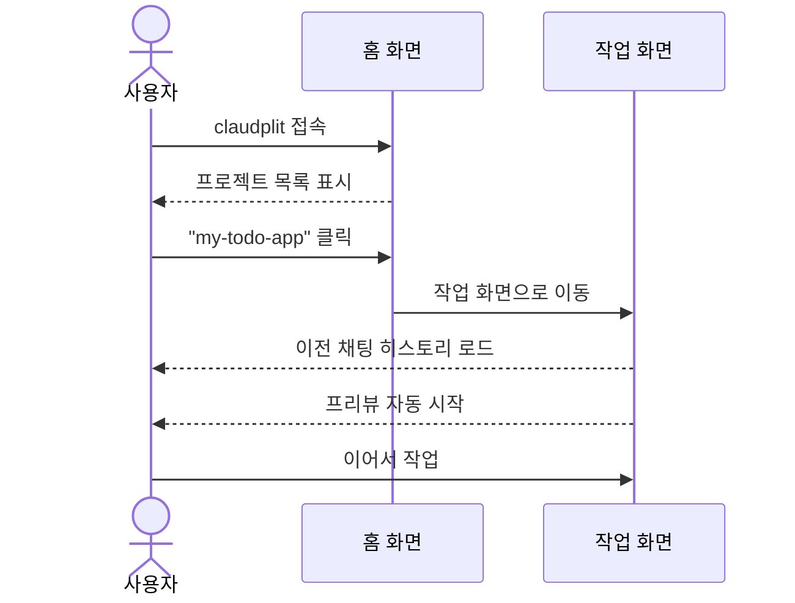
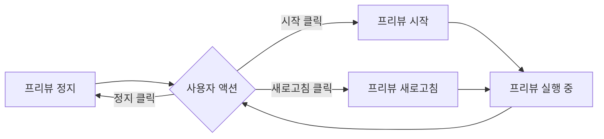
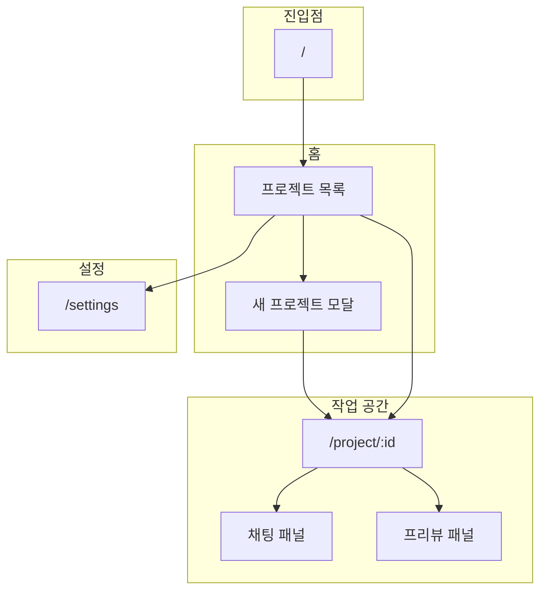
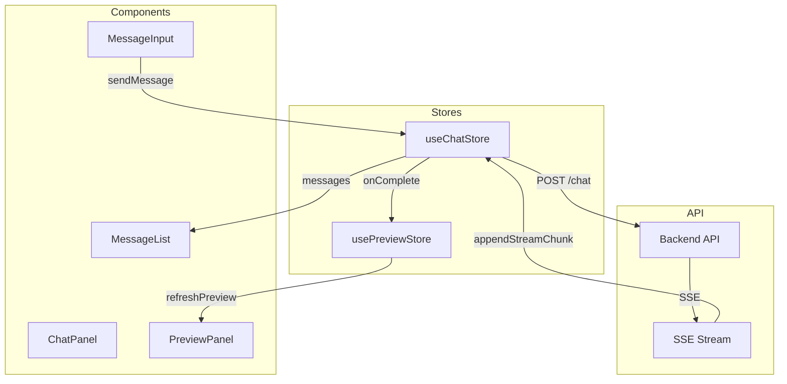

# 프론트엔드 기능 설계서

> 작성일: 2025-12-29
> 버전: 1.1 (프록시 방식 반영)

---

## 1. 개요

### 1.1 목적

claudplit 프론트엔드의 기능 설계를 정의합니다.

### 1.2 기술 스택

| 항목 | 기술 |
|------|------|
| 프레임워크 | Next.js 15 (App Router) |
| 언어 | TypeScript |
| UI 컴포넌트 | shadcn/ui |
| 스타일링 | Tailwind CSS |
| 상태 관리 | Zustand |
| HTTP 클라이언트 | fetch (내장) |
| 실시간 통신 | EventSource (SSE) |

---

## 2. 사용자 시나리오

### 2.1 시나리오 1: 첫 프로젝트 생성



### 2.2 시나리오 2: 채팅으로 앱 개발



### 2.3 시나리오 3: 기존 프로젝트 이어서 작업



### 2.4 시나리오 4: 프리뷰 제어



---

## 3. UI 흐름

### 3.1 전체 네비게이션



### 3.2 페이지별 구조

#### 3.2.1 홈 화면 (`/`)

```
┌─────────────────────────────────────────────────────────┐
│  ┌─────────────────────────────────────────────────┐    │
│  │  claudplit                        [설정]        │    │
│  └─────────────────────────────────────────────────┘    │
│                                                         │
│  ┌─────────────────────────────────────────────────┐    │
│  │  내 프로젝트                    [+ 새 프로젝트]  │    │
│  └─────────────────────────────────────────────────┘    │
│                                                         │
│  ┌──────────────┐  ┌──────────────┐  ┌──────────────┐  │
│  │ my-todo-app  │  │ blog-site    │  │ + 새 프로젝트 │  │
│  │              │  │              │  │              │  │
│  │ Next.js      │  │ Next.js      │  │              │  │
│  │ 2시간 전     │  │ 어제         │  │              │  │
│  └──────────────┘  └──────────────┘  └──────────────┘  │
│                                                         │
└─────────────────────────────────────────────────────────┘
```

#### 3.2.2 작업 화면 (`/project/:id`)

```
┌─────────────────────────────────────────────────────────┐
│  ┌─────────────────────────────────────────────────┐    │
│  │  ← 홈  │  my-todo-app              [설정]       │    │
│  └─────────────────────────────────────────────────┘    │
├─────────────────────────┬───────────────────────────────┤
│                         │                               │
│      채팅 패널           │         프리뷰 패널            │
│      (50%)              │         (50%)                 │
│                         │                               │
│  ┌───────────────────┐  │  ┌─────────────────────────┐  │
│  │ 🤖 안녕하세요!     │  │  │ ┌─────────────────────┐ │  │
│  │    무엇을 만들어   │  │  │ │  프리뷰 컨트롤 바    │ │  │
│  │    드릴까요?       │  │  │ │ [▶시작][↻새로고침]  │ │  │
│  └───────────────────┘  │  │ └─────────────────────┘ │  │
│                         │  │                         │  │
│  ┌───────────────────┐  │  │  ┌───────────────────┐  │  │
│  │ 👤 할일 목록 앱을  │  │  │  │                   │  │  │
│  │    만들어줘        │  │  │  │   프리뷰 영역      │  │  │
│  └───────────────────┘  │  │  │   (iframe)        │  │  │
│                         │  │  │                   │  │  │
│  ┌───────────────────┐  │  │  │                   │  │  │
│  │ 🤖 네, 할일 목록   │  │  │  └───────────────────┘  │  │
│  │    앱을 만들겠습...│  │  │                         │  │
│  │    ▌ (스트리밍)    │  │  └─────────────────────────┘  │
│  └───────────────────┘  │                               │
│                         │  ┌─────────────────────────┐  │
│  ┌───────────────────┐  │  │ 상태: 실행 중 (프록시)   │  │
│  │ 메시지 입력...     │  │  └─────────────────────────┘  │
│  │              [전송]│  │                               │
│  └───────────────────┘  │                               │
│                         │                               │
└─────────────────────────┴───────────────────────────────┘
```

#### 3.2.3 설정 화면 (`/settings`)

```
┌─────────────────────────────────────────────────────────┐
│  ┌─────────────────────────────────────────────────┐    │
│  │  ← 홈  │  설정                                  │    │
│  └─────────────────────────────────────────────────┘    │
│                                                         │
│  ┌─────────────────────────────────────────────────┐    │
│  │  Claude Code 설정                                │    │
│  ├─────────────────────────────────────────────────┤    │
│  │  CLI 경로: [/usr/local/bin/claude          ]    │    │
│  │  상태: ✅ 연결됨                                 │    │
│  │                                                  │    │
│  │  권한 처리 모드:                                 │    │
│  │  ○ 자동 승인 (빠르지만 위험할 수 있음)           │    │
│  │  ● 사용자 확인 (권한 요청 시 승인 필요)          │    │
│  └─────────────────────────────────────────────────┘    │
│                                                         │
│  ┌─────────────────────────────────────────────────┐    │
│  │  프로젝트 설정                                   │    │
│  ├─────────────────────────────────────────────────┤    │
│  │  기본 저장 경로: [~/claudplit-projects     ]    │    │
│  │  기본 프레임워크: [Next.js              ▼]      │    │
│  └─────────────────────────────────────────────────┘    │
│                                                         │
│  ┌─────────────────────────────────────────────────┐    │
│  │  프리뷰 설정                                     │    │
│  ├─────────────────────────────────────────────────┤    │
│  │  포트 범위: [3001] ~ [3099]                     │    │
│  │  자동 시작: [✓]                                 │    │
│  └─────────────────────────────────────────────────┘    │
│                                                         │
└─────────────────────────────────────────────────────────┘
```

---

## 4. 컴포넌트 구조

### 4.1 디렉토리 구조

```
apps/web/
├── app/
│   ├── layout.tsx              # 루트 레이아웃
│   ├── page.tsx                # 홈 (프로젝트 목록)
│   ├── project/
│   │   └── [id]/
│   │       └── page.tsx        # 작업 화면
│   └── settings/
│       └── page.tsx            # 설정
│
├── components/
│   ├── ui/                     # shadcn/ui 컴포넌트
│   │   ├── button.tsx
│   │   ├── input.tsx
│   │   ├── dialog.tsx
│   │   └── ...
│   │
│   ├── layout/
│   │   ├── Header.tsx          # 상단 헤더
│   │   └── Container.tsx       # 페이지 컨테이너
│   │
│   ├── project/
│   │   ├── ProjectCard.tsx     # 프로젝트 카드
│   │   ├── ProjectList.tsx     # 프로젝트 목록
│   │   └── CreateProjectModal.tsx  # 생성 모달
│   │
│   ├── chat/
│   │   ├── ChatPanel.tsx       # 채팅 패널 (컨테이너)
│   │   ├── MessageList.tsx     # 메시지 목록
│   │   ├── MessageItem.tsx     # 개별 메시지
│   │   ├── MessageInput.tsx    # 메시지 입력
│   │   └── StreamingMessage.tsx # 스트리밍 메시지
│   │
│   ├── preview/
│   │   ├── PreviewPanel.tsx    # 프리뷰 패널 (컨테이너)
│   │   ├── PreviewFrame.tsx    # iframe 래퍼
│   │   ├── PreviewControls.tsx # 컨트롤 바
│   │   └── PreviewStatus.tsx   # 상태 표시
│   │
│   └── workspace/
│       └── WorkspaceLayout.tsx # 채팅+프리뷰 레이아웃
│
├── stores/
│   ├── useProjectStore.ts      # 프로젝트 상태
│   ├── useChatStore.ts         # 채팅 상태
│   └── usePreviewStore.ts      # 프리뷰 상태
│
├── hooks/
│   ├── useProjects.ts          # 프로젝트 CRUD
│   ├── useChat.ts              # 채팅 훅
│   ├── useSSE.ts               # SSE 연결
│   └── usePreview.ts           # 프리뷰 제어
│
├── lib/
│   ├── api.ts                  # API 클라이언트
│   └── utils.ts                # 유틸리티
│
└── types/
    ├── project.ts              # 프로젝트 타입
    ├── chat.ts                 # 채팅 타입
    └── preview.ts              # 프리뷰 타입
```

### 4.2 주요 컴포넌트 명세

#### ChatPanel

```typescript
interface ChatPanelProps {
  projectId: string;
}

// 책임:
// - 메시지 목록 표시
// - 메시지 입력 처리
// - SSE 스트리밍 연결 관리
// - 스크롤 자동 이동
```

#### PreviewPanel

```typescript
interface PreviewPanelProps {
  projectId: string;
}

// 책임:
// - iframe으로 프리뷰 표시
// - 프리뷰 시작/중지/새로고침
// - 상태 표시 (포트, 실행 상태)
// - 에러 핸들링
```

#### MessageItem

```typescript
interface MessageItemProps {
  message: ChatMessage;
  isStreaming?: boolean;
}

// 책임:
// - 역할별 스타일링 (user/assistant)
// - 마크다운 렌더링
// - 코드 블록 하이라이팅
// - 스트리밍 커서 표시
```

---

## 5. 상태 관리

### 5.1 Zustand 스토어 설계

#### useProjectStore

```typescript
interface ProjectState {
  // 상태
  projects: Project[];
  currentProject: Project | null;
  isLoading: boolean;
  error: string | null;

  // 액션
  fetchProjects: () => Promise<void>;
  createProject: (data: CreateProjectInput) => Promise<Project>;
  deleteProject: (id: string) => Promise<void>;
  setCurrentProject: (project: Project | null) => void;
}
```

#### useChatStore

```typescript
interface ChatState {
  // 상태
  messages: ChatMessage[];
  isStreaming: boolean;
  streamingContent: string;
  error: string | null;

  // 액션
  fetchMessages: (projectId: string) => Promise<void>;
  sendMessage: (projectId: string, content: string) => Promise<void>;
  appendStreamChunk: (chunk: string) => void;
  finalizeStream: (message: ChatMessage) => void;
  clearMessages: () => void;
}
```

#### usePreviewStore

```typescript
interface PreviewState {
  // 상태
  status: 'stopped' | 'starting' | 'running' | 'error';
  url: string | null;  // 프록시 URL: /preview/{projectId}/
  error: string | null;

  // 액션
  startPreview: (projectId: string) => Promise<void>;
  stopPreview: (projectId: string) => Promise<void>;
  refreshPreview: () => void;
  setStatus: (status: PreviewStatus) => void;
}

// 프리뷰 URL 생성 (프록시 경유)
const getPreviewUrl = (projectId: string) => `/preview/${projectId}/`;
```

### 5.2 데이터 흐름



---

## 6. 기능 요구사항

### 6.1 프로젝트 관리

| ID | 기능 | 설명 | 우선순위 |
|----|------|------|----------|
| P-01 | 프로젝트 목록 조회 | 생성된 프로젝트 목록 표시 | P0 |
| P-02 | 프로젝트 생성 | 이름, 프레임워크 선택하여 생성 | P0 |
| P-03 | 프로젝트 삭제 | 확인 후 삭제 | P0 |
| P-04 | 프로젝트 선택 | 클릭하여 작업 화면 이동 | P0 |
| P-05 | 마지막 수정일 표시 | 프로젝트 카드에 표시 | P1 |

### 6.2 채팅

| ID | 기능 | 설명 | 우선순위 |
|----|------|------|----------|
| C-01 | 메시지 전송 | 텍스트 입력 후 전송 | P0 |
| C-02 | 스트리밍 응답 | AI 응답 실시간 표시 | P0 |
| C-03 | 채팅 히스토리 | 이전 대화 내용 로드 | P0 |
| C-04 | 마크다운 렌더링 | 코드 블록, 링크 등 | P0 |
| C-05 | 코드 하이라이팅 | 언어별 구문 강조 | P1 |
| C-06 | 자동 스크롤 | 새 메시지 시 하단 이동 | P1 |
| C-07 | 전송 중 비활성화 | 스트리밍 중 입력 방지 | P1 |

### 6.3 프리뷰

| ID | 기능 | 설명 | 우선순위 |
|----|------|------|----------|
| V-01 | 프리뷰 표시 | iframe으로 앱 표시 | P0 |
| V-02 | 프리뷰 시작 | Dev server 시작 | P0 |
| V-03 | 프리뷰 중지 | Dev server 중지 | P0 |
| V-04 | 프리뷰 새로고침 | iframe 리로드 | P0 |
| V-05 | 상태 표시 | 실행 상태, 포트 표시 | P0 |
| V-06 | 자동 새로고침 | 코드 변경 시 (HMR) | P1 |
| V-07 | 에러 표시 | 빌드 에러 등 표시 | P1 |
| V-08 | 새 창에서 열기 | 프리뷰 별도 창 | P2 |

### 6.4 설정

| ID | 기능 | 설명 | 우선순위 |
|----|------|------|----------|
| S-01 | Claude CLI 상태 확인 | 설치/연결 상태 | P0 |
| S-02 | 권한 처리 모드 | 자동 승인 / 사용자 확인 | P0 |
| S-03 | 프로젝트 저장 경로 | 기본 경로 설정 | P1 |
| S-04 | 기본 프레임워크 | 프로젝트 생성 시 기본값 | P2 |
| S-05 | 포트 범위 설정 | 프리뷰 포트 범위 | P2 |

**권한 처리 모드:**
- **자동 승인**: `--dangerously-skip-permissions` 사용, 모든 파일 작업 자동 허용
- **사용자 확인**: Hooks 시스템 사용, 파일 작업 시 UI에서 승인/거부

---

## 7. 개발 계획

### 7.1 Phase 1: 기본 구조 (1단계)

```mermaid
gantt
    title Phase 1: 기본 구조
    dateFormat  X
    axisFormat %s

    section 프로젝트 설정
    Next.js 초기화           :p1, 0, 1
    shadcn/ui 설정           :p2, after p1, 1
    Zustand 설정             :p3, after p2, 1

    section 레이아웃
    Header 컴포넌트          :l1, after p3, 1
    Container 컴포넌트       :l2, after l1, 1

    section 홈 화면
    ProjectList              :h1, after l2, 1
    ProjectCard              :h2, after h1, 1
    CreateProjectModal       :h3, after h2, 1
```



**완료 조건:**
- [ ] 프로젝트 목록 표시
- [ ] 프로젝트 생성 모달
- [ ] 기본 라우팅

### 7.2 Phase 2: 채팅 기능 (2단계)

```mermaid
gantt
    title Phase 2: 채팅 기능
    dateFormat  X
    axisFormat %s

    section 채팅 UI
    ChatPanel 레이아웃       :c1, 0, 1
    MessageList              :c2, after c1, 1
    MessageItem              :c3, after c2, 1
    MessageInput             :c4, after c3, 1

    section 상태 관리
    useChatStore             :s1, after c4, 1

    section API 연동
    메시지 전송              :a1, after s1, 1
    SSE 스트리밍             :a2, after a1, 2
    히스토리 로드            :a3, after a2, 1
```



**완료 조건:**
- [ ] 메시지 입력/전송
- [ ] 스트리밍 응답 표시
- [ ] 채팅 히스토리 로드

### 7.3 Phase 3: 프리뷰 기능 (3단계)

```mermaid
gantt
    title Phase 3: 프리뷰 기능
    dateFormat  X
    axisFormat %s

    section 프리뷰 UI
    PreviewPanel 레이아웃    :v1, 0, 1
    PreviewFrame             :v2, after v1, 1
    PreviewControls          :v3, after v2, 1
    PreviewStatus            :v4, after v3, 1

    section 상태 관리
    usePreviewStore          :s1, after v4, 1

    section API 연동
    시작/중지 API            :a1, after s1, 1
    상태 폴링                :a2, after a1, 1
```



**완료 조건:**
- [ ] 프리뷰 iframe 표시
- [ ] 시작/중지/새로고침
- [ ] 상태 표시

### 7.4 Phase 4: 통합 및 완성 (4단계)

```mermaid
gantt
    title Phase 4: 통합 및 완성
    dateFormat  X
    axisFormat %s

    section 통합
    WorkspaceLayout          :w1, 0, 1
    채팅-프리뷰 연동         :w2, after w1, 1

    section 설정
    설정 화면                :s1, after w2, 1
    CLI 상태 확인            :s2, after s1, 1

    section 마무리
    에러 핸들링              :f1, after s2, 1
    로딩 상태                :f2, after f1, 1
    반응형 조정              :f3, after f2, 1
```



**완료 조건:**
- [ ] 채팅 + 프리뷰 통합 화면
- [ ] 설정 화면
- [ ] 에러 핸들링

---

## 8. 기술 고려사항

### 8.1 SSE 스트리밍

```typescript
// hooks/useSSE.ts
export function useSSE(url: string, onMessage: (data: string) => void) {
  useEffect(() => {
    const eventSource = new EventSource(url);

    eventSource.onmessage = (event) => {
      onMessage(event.data);
    };

    eventSource.onerror = () => {
      eventSource.close();
    };

    return () => eventSource.close();
  }, [url, onMessage]);
}
```

### 8.2 마크다운 렌더링

- `react-markdown` 사용
- `rehype-highlight`로 코드 하이라이팅
- `remark-gfm`으로 GFM 지원

### 8.3 iframe 프리뷰 (프록시 방식)

**프록시 경유 이유:**
- iframe에서 다른 포트 직접 접근 시 CORS 이슈 발생
- WebSocket 기반 HMR 연결 실패
- 내부 포트 직접 노출 방지

**URL 구조:**
```typescript
// 프리뷰 URL (프록시 경유)
const previewUrl = `/preview/${projectId}/`;
// → NestJS 백엔드가 프록시하여 Dev Server로 전달
```

**iframe 구현:**
```typescript
<iframe
  src={previewUrl}
  sandbox="allow-scripts allow-same-origin allow-forms allow-modals"
  // allow-same-origin: 프록시 경유로 same-origin 유지
  // allow-modals: alert, confirm 등 지원
/>
```

**HMR 자동 지원:**
- 백엔드 프록시가 WebSocket 업그레이드 처리
- 코드 변경 시 자동 새로고침 (추가 구현 불필요)

### 8.4 반응형 레이아웃

```typescript
// 채팅:프리뷰 비율 조정
// 기본: 50:50
// 태블릿: 스택 (세로 배치)
```

---

## 9. 참고

- [002-requirements.md](./002-requirements.md) - 요구사항 정의서
- [shadcn/ui 문서](https://ui.shadcn.com/)
- [Zustand 문서](https://zustand-demo.pmnd.rs/)
